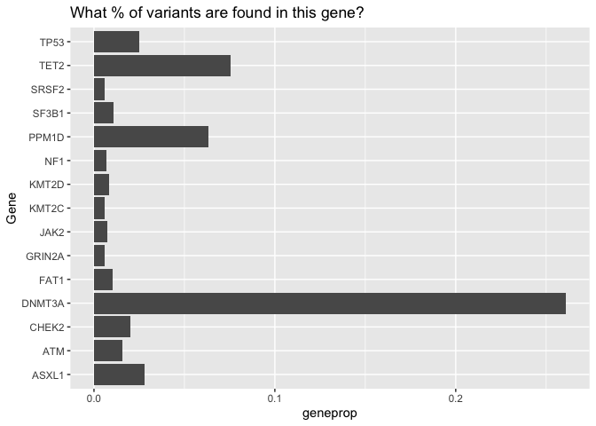
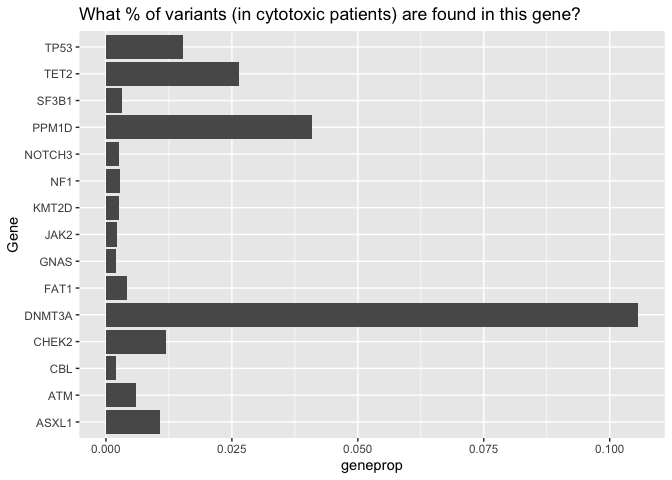
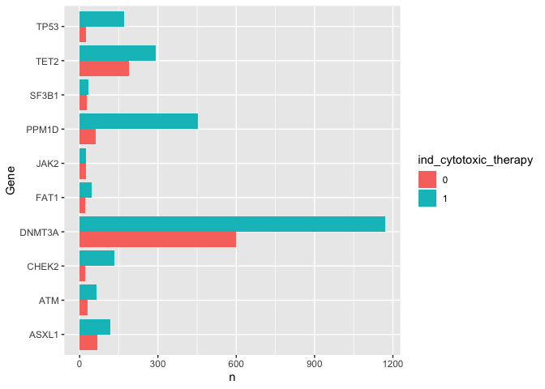
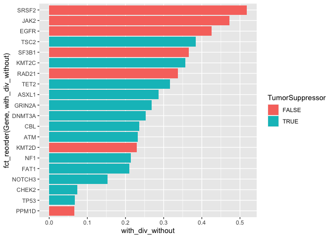

Exploratory Data Analysis
================
Kaitlyn Westra, partner: Danish Ansari
November 2020

Background Information
----------------------

-   *Topic or Overall Question:* Genetic Mutations arising from Cancer Therapies

-   *Data sources I'm considering:* <https://github.com/papaemmelab/bolton_NG_CH>

-   *Why I'm interested:*
    -   *Nature Genetics* is one of the most well-known and well-respected journals in the field of genetics. The work that these articles are based on is of high quality, and presents some of the latest and greatest ideas in the field. Due to this, many experts frequently read these recently published articles, and regard getting published in the journal as a great achievement.
    -   Over the past 6 months, I've worked as a research intern at Grand Rapids' Van Andel Institute, in a [lab](https://braslab.vai.org) that studies the genetics of neurodegenerative diseases, like Parkinson's Disease, Alzhiemer's Disease, and dementia with Lewy bodies. Throughout this internship, I have been able to learn about the intersection of genetics, disease, and data science, using R and other genomics tools to analyze genetic mutation data and make discoveries that have an impact on people's lives.
    -   Because of this introduction I've had to the field of genetics annd bioinformatics, I have been curious what *other* labs and groups do with similar data. This lead me to browse through the [cBioPortal for Cancer Genomics](https://www.cbioportal.org), which I had heard about from a series of online [Dataviz + Cancer Microlabs](https://apply.hub.ki/cancerplusviz/). The dataset I had found was used in a recent *Nature Genetics* article, "[Cancer therapy shapes the fitness landscape of clonal hematopoiesis](https://www.nature.com/articles/s41588-020-00710-0)" so I decided this would be perfect for my final project.

Setup
-----

Read in Data from repo (code copied from author's .Rmd):

``` r
#Input data
setwd('./data')

M_long = suppressWarnings(data.table::fread('M_long.txt', sep = '\t', header = T)) %>%
  as.data.frame()

unzip(zipfile = 'M_wide_all.txt.zip')
M_wide_all = suppressWarnings(data.table::fread('M_wide_all.txt', sep = '\t', header = T)) %>%
  as.data.frame()

M2_all = suppressWarnings(data.table::fread('M2_all.txt', sep = '\t', header = T))  %>%
  as.data.frame()

M_tmn_wide_st = suppressWarnings(data.table::fread('M_tmn_wide_st.txt', sep = '\t', header = T)) %>% 
  as.data.frame()

M_tmn_h = suppressWarnings(data.table::fread('M_tmn_h.txt', sep = '\t', header = T))  %>%
  as.data.frame()

M_tmn_long = suppressWarnings(data.table::fread('M_tmn_long.txt', sep = '\t', header = T))  %>%
  as.data.frame()

P_serial = suppressWarnings(data.table::fread('P_serial.txt', sep = '\t', header = T))  %>%
  as.data.frame()

T_seer = read_tsv('breast_prop_chemo.txt', col_types = cols()) 

tmn_inc = read_tsv('CumIncByYear-20190716_KB_Wolff.txt', col_types = cols()) %>%
    dplyr::select(Year, yearly_inc) %>% as.data.frame %>% unname %>% as.matrix

mort_inc = read_tsv('overall_mort_50_75.txt', col_types = cols()) %>%
    dplyr::select(time, year_inc) %>% as.data.frame %>% unname %>% as.matrix

#Dictionaries:
class_dict <- read.csv("chemoclass_jan2019_revised.csv", stringsAsFactors = F)

drugsets_dict <- read.csv("top_sets_dec2018.csv", header = T, stringsAsFactors = F)

class_dict <- class_dict %>% filter(drugclass_c=="cytotoxic_therapy")

setwd('../')
```

Exploratory Data Analysis
-------------------------

-   Specific questions I'm thinking of asking:
-   which genes (Gene) predict specific types of tumors (generaltumortype)?
-   which genes (Gene) have more mutations in smokers (smoke)?
-   which genes (Gene) have more mutations in patients that have undergone cancer therapy (ind\_target\_therapy)(ind\_immune\_therapy)(XRT)(ind\_cytotoxic\_therapy)?
-   which variant class (silent, missense, splice, frameshift, etc) or variant type (deletion, insertion, SNV) leads
-   Characteristics of the data that will allow me to answer those questions: \_\_\_\_\_ (e.g., names of specific columns in specific datasets that have that data) -columns include: "generaltumortype", "Gene", "VariantClass", "variant\_type", "myeloid\_gene", "smoke"/"smoke\_bin", "therapy\_binary", "ind\_anychemo", "ind\_radiotherapy", "ind\_cytotoxic\_therapy".

``` r
datasets_names <- c('M_long', 'M_wide_all', 'M2_all', 'M_tmn_wide_st', 'M_tmn_h', 'M_tmn_long', 'P_serial', 'T_seer', 'tmn_inc', 'mort_inc')
class_dict %>% glimpse()
```

    ## Rows: 95
    ## Columns: 4
    ## $ drugclass_b <chr> "actinomycin", "alkylating_agent", "antimetabolite", "cyt…
    ## $ drugclass_a <chr> "actinomycin", "cytotoxic_therapy_other", "cytadine_analo…
    ## $ drugname    <chr> "dactinomycin", "thiotepa", "decitabine", "leq506", "reti…
    ## $ drugclass_c <chr> "cytotoxic_therapy", "cytotoxic_therapy", "cytotoxic_ther…

``` r
drugsets_dict %>% glimpse()
```

    ## Rows: 388
    ## Columns: 2
    ## $ drugset_name  <chr> "3f8_irinotecan", "3f8_irinotecan_temozolomide", "abrax…
    ## $ drugset_alias <chr> "ds_cytotoxic_other", "ds_cytotoxic_other", "ds_cytotox…

"which genes (Gene) have more mutations in patients that have undergone cancer therapy (ind\_target\_therapy)(ind\_immune\_therapy)(XRT)(ind\_cytotoxic\_therapy)?"

``` r
M_long %>% names()
```

    ##  [1] "STUDY_ID"               "generaltumortype"       "Chrom"                 
    ##  [4] "Start"                  "End"                    "Ref"                   
    ##  [7] "Alt"                    "Gene"                   "VariantClass"          
    ## [10] "variant_type"           "cDNAchange"             "AAchange"              
    ## [13] "sub_nuc"                "ch_pancan_pd"           "myeloid_gene"          
    ## [16] "VAF_N"                  "CH_all"                 "CH_nonsilent"          
    ## [19] "CH_silent"              "CH_my"                  "ch_nonmy_pd"           
    ## [22] "ch_my_pd"               "therapy_known"          "Gender"                
    ## [25] "race"                   "age"                    "smoke"                 
    ## [28] "smoke_bin"              "therapy_binary"         "XRT"                   
    ## [31] "eqd_3_t"                "ind_anychemo"           "ind_radiotherapy"      
    ## [34] "ind_cytotoxic_therapy"  "pct_cytotoxic_therapy"  "time_cytotoxic_therapy"
    ## [37] "time_end_xrt"

``` r
cytotoxic_patients <- c()
cytotoxic_patients$yes_cyto <- sum(M_long$ind_cytotoxic_therapy == 1, na.rm = TRUE)
cytotoxic_patients$no_cyto <- sum(M_long$ind_cytotoxic_therapy == 0, na.rm = TRUE)
cytotoxic_patients <- as.data.frame(cytotoxic_patients)

M_long %>%
  group_by(Gene) %>%
  count() %>%
  mutate(geneprop = n / nrow(M_long)) %>%
  arrange(desc(geneprop)) %>%
  head(15) %>%
  ggplot(aes(y = Gene, x = geneprop)) +
    geom_col() +
    labs(title = "What % of variants are found in this gene?")
```



``` r
M_long[(M_long$ind_cytotoxic_therapy == 1) & (!is.na(M_long$ind_cytotoxic_therapy)),] %>%
  group_by(Gene) %>%
  count() %>%
  mutate(geneprop = n / nrow(M_long)) %>%
  arrange(desc(geneprop)) %>%
  head(15) %>%
  ggplot(aes(y = Gene, x = geneprop)) +
    geom_col() +
    labs(title = "What % of variants (in cytotoxic patients) are found in this gene?")
```



``` r
M_long %>%
  filter(!is.na(ind_cytotoxic_therapy)) %>%
  group_by(Gene, ind_cytotoxic_therapy) %>%
  summarize(n = n()) %>%
  ungroup() %>%
  group_by(Gene) %>%
  summarize(n_gene = sum(n),
            Gene, ind_cytotoxic_therapy, n) %>%
  arrange(desc(n_gene)) %>%
  head(20) %>%
  mutate(ind_cytotoxic_therapy = as.factor(ind_cytotoxic_therapy)) %>%
  ggplot(aes(y = Gene, x=n, fill = ind_cytotoxic_therapy)) +
    geom_col(position = "dodge")
```

    ## `summarise()` regrouping output by 'Gene' (override with `.groups` argument)
    ## `summarise()` regrouping output by 'Gene' (override with `.groups` argument)



### Dataset Summaries

`M_long`: - each row contains information about a specific genetic mutation (variant), including the basic information about it (chromosome, position, reference allele, alternate allele), along with more helpful annotation information, such as what gene the variant is found in, the variant's class (e.g., Missense) & type (e.g., Single Nucleotide Variant), the DNA change and rseulting Amino Acid change, .... etc.
- *"We identified 11,076 unique CH mutations in 7,216 individ- uals, representing 30% of patients in our cohort."*: `M_long` is 11076 rows long :)
- *"CH mutations followed expected patterns of positive selection for truncating variants and missense mutations in tumor suppressors and oncogenes"*

``` r
glimpse(M_long)
```

    ## Rows: 11,076
    ## Columns: 37
    ## $ STUDY_ID               <int> 663, 1172, 10115, 5691, 6376, 653, 7065, 9724,…
    ## $ generaltumortype       <chr> "Non-Small Cell Lung Cancer", "Non-Small Cell …
    ## $ Chrom                  <int> 1, 1, 1, 1, 1, 1, 1, 1, 1, 1, 1, 1, 1, 1, 1, 1…
    ## $ Start                  <int> 2491283, 2491316, 2491342, 2492081, 8073525, 8…
    ## $ End                    <int> 2491283, 2491316, 2491342, 2492081, 8073525, 8…
    ## $ Ref                    <chr> "G", "G", "G", "C", "G", "C", "C", "T", "A", "…
    ## $ Alt                    <chr> "A", "A", "T", "A", "A", "T", "T", "G", "G", "…
    ## $ Gene                   <chr> "TNFRSF14", "TNFRSF14", "TNFRSF14", "TNFRSF14"…
    ## $ VariantClass           <chr> "Missense_Mutation", "Missense_Mutation", "Mis…
    ## $ variant_type           <chr> "SNV", "SNV", "SNV", "SNV", "SNV", "SNV", "SNV…
    ## $ cDNAchange             <chr> "c.326G>A", "c.359G>A", "c.385G>T", "c.479C>A"…
    ## $ AAchange               <chr> "p.R109Q", "p.G120D", "p.V129F", "p.T160N", "p…
    ## $ sub_nuc                <chr> "C>T", "C>T", "C>A", "C>A", "C>T", "C>T", "C>T…
    ## $ ch_pancan_pd           <int> 0, 0, 0, 0, 0, 0, 0, 0, 0, 0, 0, 0, 0, 0, 0, 0…
    ## $ myeloid_gene           <lgl> FALSE, FALSE, FALSE, FALSE, FALSE, FALSE, FALS…
    ## $ VAF_N                  <dbl> 0.08978873, 0.02414487, 0.03030303, 0.03389831…
    ## $ CH_all                 <int> 1, 1, 1, 1, 1, 1, 1, 1, 1, 1, 1, 1, 1, 1, 1, 1…
    ## $ CH_nonsilent           <int> 1, 1, 1, 1, 0, 0, 1, 1, 1, 1, 0, 1, 1, 1, 1, 1…
    ## $ CH_silent              <int> 0, 0, 0, 0, 1, 1, 0, 0, 0, 0, 1, 0, 0, 0, 0, 0…
    ## $ CH_my                  <int> 0, 0, 0, 0, 0, 0, 0, 0, 0, 0, 0, 0, 0, 0, 0, 0…
    ## $ ch_nonmy_pd            <int> 0, 0, 0, 0, 0, 0, 0, 0, 0, 0, 0, 0, 0, 0, 0, 0…
    ## $ ch_my_pd               <int> 0, 0, 0, 0, 0, 0, 0, 0, 0, 0, 0, 0, 0, 0, 0, 0…
    ## $ therapy_known          <int> 1, 1, 0, 0, 0, 0, 1, 0, 1, 0, 0, 0, 0, 0, 0, 0…
    ## $ Gender                 <chr> "Male", "Male", "Male", "Male", "Male", "Femal…
    ## $ race                   <chr> "White", "White", "White", "White", "White", "…
    ## $ age                    <dbl> 54.06982, 68.26283, 69.94935, 36.81588, 53.946…
    ## $ smoke                  <int> 1, 2, 0, 0, 2, 0, 0, 2, 2, 2, 2, 2, 2, 2, 2, 0…
    ## $ smoke_bin              <int> 1, 1, 0, 0, 1, 0, 0, 1, 1, 1, 1, 1, 1, 1, 1, 0…
    ## $ therapy_binary         <chr> "untreated", "treated", NA, NA, NA, NA, "treat…
    ## $ XRT                    <int> 0, 0, 1, NA, 1, NA, 1, NA, 0, 1, NA, NA, NA, 1…
    ## $ eqd_3_t                <int> 0, 0, NA, NA, 3, NA, 3, NA, 0, 3, NA, NA, NA, …
    ## $ ind_anychemo           <int> 0, 1, NA, NA, 1, NA, 0, NA, 0, 1, 1, NA, NA, N…
    ## $ ind_radiotherapy       <int> 0, 0, NA, NA, NA, NA, 0, NA, 0, NA, NA, NA, NA…
    ## $ ind_cytotoxic_therapy  <int> 0, 1, NA, NA, 1, NA, 0, NA, 0, 1, NA, NA, NA, …
    ## $ pct_cytotoxic_therapy  <int> 0, 3, NA, NA, NA, NA, 0, NA, 0, 1, NA, NA, NA,…
    ## $ time_cytotoxic_therapy <int> NA, 944, NA, NA, 126, NA, NA, NA, NA, 4152, NA…
    ## $ time_end_xrt           <int> NA, NA, 232, NA, 0, NA, 0, NA, 0, 302, NA, NA,…

``` r
nrow(M_long) == M_long %>%
  mutate(variant_ID = paste(Chrom, Start, Ref, Alt, sep = "-")) %>%
  dplyr::n_distinct(.$variant_ID)
```

    ## [1] TRUE

Additional Data:
----------------

We can use the [Tumor Suppressor Gene Database (TSGene)](https://bioinfo.uth.edu/TSGene/download.cgi?csrt=9096171844716038094)'s list of 1217 human [tumor suppressor genes](https://bioinfo.uth.edu/TSGene/Human_TSGs.txt?csrt=9096171844716038094) to determine the category of each of our top genes.

``` r
tumor_suppressors <- read.delim('./data/tumor_suppressor_tsgene.txt') %>%
  mutate(Gene = GeneSymbol,
         TumorSuppressor = TRUE)
M_long_ts <- left_join(M_long, tumor_suppressors, "Gene")
M_long_ts <- M_long_ts %>%
  mutate(TumorSuppressor = case_when(is.na(TumorSuppressor) ~ FALSE,
                                    TRUE ~ TRUE))


M_long2 <- M_long_ts %>%
  filter(!is.na(ind_cytotoxic_therapy)) %>%
  group_by(Gene, ind_cytotoxic_therapy, TumorSuppressor) %>%
  summarize(n = n()) %>%
  ungroup() %>%
  group_by(Gene) %>%
  summarize(n_gene = sum(n),
            Gene, ind_cytotoxic_therapy, n, TumorSuppressor) %>%
  arrange(desc(n_gene)) #%>%
```

    ## `summarise()` regrouping output by 'Gene', 'ind_cytotoxic_therapy' (override with `.groups` argument)

    ## `summarise()` regrouping output by 'Gene' (override with `.groups` argument)

``` r
  #pivot_wider(names_from = ind_cytotoxic_therapy, values_from = "ind_cytotoxic_therapy")

with_cyto_M_long <- M_long2 %>%
  filter(ind_cytotoxic_therapy == 1) %>%
  select(-ind_cytotoxic_therapy)

without_cyto_M_long <- M_long2 %>%
  filter(ind_cytotoxic_therapy == 0) %>%
  select(Gene, n)

new_M_long <- full_join(with_cyto_M_long, without_cyto_M_long,
                        by = "Gene", suffix = c("_without","_with")) %>%
  mutate(prop_with = n_with / cytotoxic_patients$yes_cyto,
         prop_without = n_without / cytotoxic_patients$no_cyto,
         with_div_without = prop_with / prop_without)

new_M_long %>%
  filter(n_gene > 30) %>%
  arrange(desc(prop_with)) %>%
  ggplot(mapping = aes(x = with_div_without, y = fct_reorder(Gene, with_div_without), fill = TumorSuppressor)) +
    geom_col()
```


