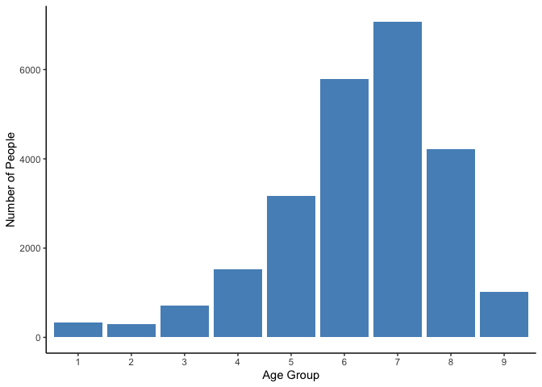
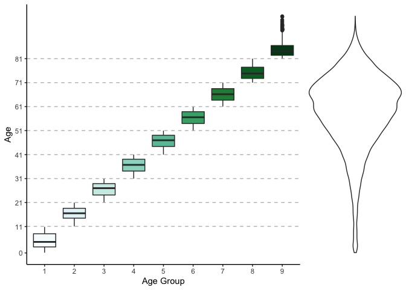

Genetic Mutations from Cancer Therapies
================
Kaitlyn Westra
Fall 2020

-   [About](#about)
-   [Introduction](#introduction)
-   [Question](#question)
    -   [Background](#background)
    -   [Project](#project)
-   [Dataset](#dataset)
-   [(?) Data Wrangling](#data-wrangling)
-   [Exploratory Data Analysis](#exploratory-data-analysis)
-   [Modeling](#modeling)
-   [Findings:](#findings)
-   [Limitations:](#limitations)
-   [Future Directions:](#future-directions)
-   [Conclusions](#conclusions)

### About

This is an outline of the things that need to be included for this final project. Below, I've copied & pasted the project outline from Professor Arnold's project description. Interspersed is bullet points of specific rubric objectives (copied & pasted from the "3 points" column in Moodle). This hopefully makes it easier to see what progress has been made & what we have left to do. At the very end, when these sections are filled in, the filler words can be deleted.

Introduction
------------

*Nature Genetics* is one of the most well-known and well-respected journals in the field of genetics. The work that these articles are based on reflect years of rigorous research, and presents some of the latest and greatest ideas in the field. Due to this, many experts regard getting published in the journal as a great achievement and frequently read these published articles.

Over the past 6 months, I've worked as a research intern at Grand Rapids' Van Andel Institute, in a [lab](https://braslab.vai.org) that studies the genetics of neurodegenerative diseases, like Parkinson's Disease, Alzhiemer's Disease, and dementia with Lewy bodies. Throughout this internship, I have been able to learn about the intersection of genetics, disease, and data science, using R and other genomics tools to analyze genetic mutation data and make discoveries that have an impact on people's lives.

Because of this introduction I've had to the field of genetics annd bioinformatics, I have been curious what *other* labs and groups do with similar data. This lead me to browse through the [cBioPortal for Cancer Genomics](https://www.cbioportal.org), which I had heard about from a series of online [Dataviz + Cancer Microlabs](https://apply.hub.ki/cancerplusviz/) that occured earlier this year. The dataset I had found was used in a recent *Nature Genetics* article, "[Cancer therapy shapes the fitness landscape of clonal hematopoiesis](https://www.nature.com/articles/s41588-020-00710-0)" so I decided this would be perfect for my final project.

Question
--------

#### Background

The background of this article follows first author Kelly Bolton, a physician scientist (MD-PhD) and first year fellow in medical oncology at Memorial Sloan Kettering, the world’s oldest and largest private cancer center. Bolton was new to studying clonal hematopoiesis (CH), but jumped on the opportunity to research it, especially to understand if specific therapy types resulted in a higher frequency of CH. With her knowledge of epidemiology, she realized that she could use data from both electronic health records and sequential samples from patients, to understand how therapy could be promoting pre-existing CH or inducing new mutations.

CH essentially happens when a hematopoietic stem cell, which can develop into different types of blood cells, starts making cells with the same genetic mutation in individuals without a blood disease. As such, clonal hematopoiesis [includes](https://www.ncbi.nlm.nih.gov/pmc/articles/PMC7065480/) the entire spectrum of premalignant conditions related to somatic mutations in genes associated with myeloid disorders. CH remains benign in most people, but sometimes progresses to malignancy.

Previously, studies have shown that certain types of chemotherapy lead to a higher risk of developing myeloid neoplasms (a class of clonal hematopoietic stem cell disorders), and also that the presence of clonal hematopoiesis increases the risk of developing these therapy-related myleoid neoplasm diseases (tMNs). Thus, the relationship between specific therapies and CH is important to investigate. Understanding this relationship can aid in the understanding of the mechanisms by which therapy-related myeloid diseases occur, and from there, can help develop interventions.

#### Project

With this project, I aim to replicate this lab's findings that mutations in genes are enriched based on specific exposures. Specifically, I will set out to verify that "**mutations in *ASXL1* are enriched in current or former smokers, whereas cancer therapy with radiation, platinum and topoisomerase II inhibitors preferentially selects for mutations in DNA damage response genes (*TP53*, *PPM1D*, *CHEK2*).**"

To do so, I will be recreating their **Figure 1c** using exactly the same data the authors used, and a combination of their published R code and some of my own original code. In this process, I will be thoroughly narrating my steps to give insight into the process and decisions that were made. Because a big part of data science and computer science is looking through others' code, understanding it, and adapting it to fit your needs, doing so with this available example will be an exercise in this skill. Being able to accomplish the objectives I have outlined herein demonstrate the knowledge I've gained this semester in DATA-202, and that I am equipped to practically apply this in new situations.

> *Much of the technical background information, including specific phrases, in this section was found in Bolton's [Nature Research blog post](https://cancercommunity.nature.com/posts/cancer-therapy-shapes-the-fitness-landscape-of-clonal-hematopoiesis).*

Dataset
-------

``` r
M_wide_all = suppressWarnings(data.table::fread('./data/M_wide_all.txt', sep = '\t', header = T)) %>%
  as.data.frame()
```

The dataset used in Figure 1c is originally called `M_wide_all`. It contains 24146 rows, with 562 columns, making it an extremely large dataset. Because there are 24146 unique `STUDY_ID`s and 24146 rows in this dataset, we know that the `STUDY_ID` acts as a unique identifier for every row. Each row contains data from one patient and their tumor, with columns for:
- their `STUDY_ID`
- the presence/number of mutations in each specific gene (`BRCA1`, `DNAJB1`, `ERBB4`, `FOXO1`, `TET2`, `TP53`, etc.)
- information about these mutations' variant allele frequency (`VAF_all`, `VAF_nonsilent`, `VAF_silent`, `VAF_my`, etc.)
- the number of different types of mutations (`mutnum_all`, `mutnum_nonsilent`, `mutnum_my`, etc.)
- the presence of clonal hematopoiesis mutations (`ch_nonmy`, `CH_nonsilent`, `ch_my_pd` \[PD being "putative cancer-driver mutations"\], etc.)
- demographic information about the patient (`Gender`, `race`, `age`)
- the patient's exposures (`therapy_known`, `therapy_binary`, `smoke`, `ind_cytotoxic_therapy`, `ind_ds_fluorouracil`, etc.).

In `M_wide_all`, it appears as if some preprocessing steps have already been taken, such as adding a column for the age categories -- breaking down each person's exact decimal age, into an age bracket. To explore how these age categories are broken down, I did the following:

``` r
#how many age groups are there?
table(M_wide_all$age_cat) %>%
  as.data.frame() %>%
  rename(`Age Group` = Var1,
         `Number of People` = Freq) %>%
  knitr::kable()
```

| Age Group |  Number of People|
|:----------|-----------------:|
| 1         |               337|
| 2         |               297|
| 3         |               708|
| 4         |              1519|
| 5         |              3177|
| 6         |              5788|
| 7         |              7074|
| 8         |              4219|
| 9         |              1027|

``` r
ggplot(data = as.data.frame(table(M_wide_all$age_cat)), aes(x = Var1, y = Freq)) +
  geom_col(fill = "#5691c1") +
  theme_classic() +
  labs(x = "Age Group", y = "Number of People")
```



From the above, we know that there are 9 different age categories, each with the following number of people.

To gain an understanding of what ages are included in each gorup, I did the following:

``` r
#give min of each boxplot / age group:
age_cutoffs <- c()
for (num in 1:9) {
  age_cutoffs <- c(age_cutoffs, M_wide_all[M_wide_all$age_cat == num,] %>%
    select(age) %>%
    min())
}
split_age_box <- ggplot(M_wide_all, aes(y = age, x = as.factor(age_cat), fill = as.factor(age_cat))) +
  geom_boxplot() +
  scale_fill_brewer(palette = "BuGn") +
  theme_classic() +
  theme(legend.position = "none") +
  labs(x = "Age Group", y = "Age", fill = "Age Group") +
  scale_y_continuous(breaks = c(0, 11, 21, 31, 41, 51, 61, 71, 81),
                   labels = c(0, 11, 21, 31, 41, 51, 61, 71, 81)) +
  geom_hline(aes(yintercept = age_cutoffs[2]), linetype = "dashed", color = "grey") +
  geom_hline(aes(yintercept = age_cutoffs[3]), linetype = "dashed", color = "grey") +
  geom_hline(aes(yintercept = age_cutoffs[4]), linetype = "dashed", color = "grey") +
  geom_hline(aes(yintercept = age_cutoffs[5]), linetype = "dashed", color = "grey") +
  geom_hline(aes(yintercept = age_cutoffs[6]), linetype = "dashed", color = "grey") +
  geom_hline(aes(yintercept = age_cutoffs[7]), linetype = "dashed", color = "grey") +
  geom_hline(aes(yintercept = age_cutoffs[8]), linetype = "dashed", color = "grey") +
  geom_hline(aes(yintercept = age_cutoffs[9]), linetype = "dashed", color = "grey")

together_age_violin <- ggplot(M_wide_all, aes(y = age, x = 0)) +
  geom_violin(fill = "white") +
  theme_void() +
  labs(x = "Full Dataset", y = "Age") +
  theme(axis.ticks.x = element_blank(),
        axis.text.x = element_blank())

cowplot::plot_grid(split_age_box, together_age_violin, ncol = 2, rel_widths = c(.75, .25), align = "h")
```



As shown above, the age cutoffs for each categroy are: 0.128679, 11.093771, 21.0047913, 31.0006847, 41.0047913, 51.0061607, 61.0020523, 71.0006866, 81.0047913, indicating that they chose 0, 11, 21, 31, 41, 51, 61, 71, 81 as their minimum ages for each age group.

To understand some of the other variables, I did some

An analysis of the appropriateness of your dataset for addressing these questions.

A brief (2-4 sentences) verbal description of the dataset: what is the dataset about?

-   **High-level dataset description:** Scholarly-level background about the data is provided. *(more than "Data Clearly Described")*

A description of its provenance: where did the data come from originally? Where did you download it from? And (as much as you can tell or speculate) how did it end up available there?

-   **Data provenance**: Thoughtful consideration of provenance, e.g., selecting between different datasets based on provenance considerations, or drawing implications for results based on provenance
    -   more than: *Answers basic provenance questions: where did the data come from originally? Where did you download it from? And (as much as you can tell or speculate) how did it end up available there? What does all of this say about whether the data is reliable for addressing the real-world questions of interest? (2 points)*

The number of records in the dataset, and what each one represents

A list of the features in the dataset and their types

-   **Data strcuture**: Data structure clearly identified: number of records, what each record is, what each feature is and what type it is, with examples (2 points)
    -   \*\*WITH:\* ... with thoughtful and critical reflection, e.g., consideration of the appropriateness of different data types (full 3 points)
-   **Approach** *(not entirely sure where this fits in)*: Approach clearly stated and thoughtfully motivated by the intersection of the real-world question and the available data
    -   more than: *Approach stated clearly in terms that map clearly to the data used*
-   **Data Appropriateness**: Particularly thoughtful consideration of data appropriateness
    -   more than: *Reflected on how the provenance and structure of the data make it appropriate (or not appropriate) for the task*

``` r
M_wide_all$ch_nonpd %>% as.factor %>% levels()
```

    ## [1] "0" "1"

``` r
M_wide_all$CH_nonsilent %>% as.factor %>% levels()
```

    ## [1] "0" "1"

``` r
colcount <- 0
for (col in M_wide_all %>% select(starts_with("ch"))){
  a <- col
  as.factor(col) %>%
    levels() %>%
    print()
  colcount <- colcount + 1
}
```

    ## [1] "0" "1"
    ## [1] "0" "1"
    ## [1] "0" "1"
    ## [1] "0" "1"
    ## [1] "0" "1"
    ## [1] "0" "1"
    ## [1] "0" "1"
    ## [1] "0" "1"
    ## [1] "0" "1"
    ## [1] "0" "1"
    ## [1] "0" "1"
    ## [1] "0" "1"
    ## [1] "0" "1"
    ## [1] "0" "1"
    ## [1] "0" "1"

``` r
print(colcount)
```

    ## [1] 15

``` r
M_wide_all$pct_cytotoxic_therapy %>% as.factor %>% levels()
```

    ## [1] "0" "1" "2" "3"

``` r
M_wide_all$pct_microtubule_damaging %>% as.factor %>% levels()
```

    ## [1] "0" "1" "2" "3"

``` r
M_wide_all$pct_alkylating_agent %>% as.factor %>% levels()
```

    ## [1] "0" "1" "2" "3"

``` r
M_wide_all$pct_targeted_therapy %>% as.factor %>% levels()
```

    ## [1] "0" "1" "2" "3"

``` r
M_wide_all$ind_ds_fluorouracil %>% as.factor %>% levels()
```

    ## [1] "0" "1"

``` r
M_wide_all$pct_topoisomerase_i_inhi %>% as.factor %>% levels()
```

    ## [1] "0" "1" "2" "3"

``` r
M_wide_all$pct_topoisomerase_ii_inh %>% as.factor %>% levels()
```

    ## [1] "0" "1" "2" "3"

They go on to "Process dataframes a bit", which I'll walk through next.

``` r
M_wide_all = M_wide_all %>%
    mutate(race_b = as.integer(race == "White")) %>%
    mutate(age_scaled = as.vector(scale(age)),
           age_d=age/10) %>%
    mutate(mutnum_all_r = case_when(
      mutnum_all ==0 ~ 0,
      mutnum_all == 1 ~ 1,
      mutnum_all >= 2 ~ 2)) %>%
    mutate(smoke_bin=case_when(
      smoke==0 ~ 0,
      smoke==1 ~ 1,
      smoke==2 ~ 1)) %>%
    mutate(
      Gender = relevel(factor(Gender), ref = 'Male'),
      race = relevel(factor(race), "White"),
      smoke = relevel(factor(smoke), "0"),
      smoke_bin = relevel(factor(smoke_bin), "0"),
      therapy_binary = relevel(factor(therapy_binary), 'untreated')
    )

#Define wide data frame with treatment known
M_wide <- M_wide_all %>% filter(therapy_known==1)
```

(?) Data Wrangling
------------------

\[?\] *Not included explictly on outline, but I think this section would be helpful...*

-   Thoughtful reflection on choices made in data wrangling and/or their implications on subsequent analysis
    -   more than: *Correctly performed needed data wrangling, e.g., merging multiple data sources, aggregating, re-coding data, identifying and dealing with missing data*

Exploratory Data Analysis
-------------------------

Show plots illustrating the distribution of at least 4 variables in your dataset. Comment on anything interesting you observe.

-   **Univariate EDA**: Includes insightful / thoughtful commentary on implications of the distributions plotted (perhaps how that informs further analysis)
    -   more than: *Includes plots illustrating the distribution of more than one variable in the dataset, with some commentary.*

Show plots illustrating bivariate relationships for at least 2 pairs of variables. Explain what you observe (e.g., positive/negative correlation, no correlation, etc.).

-   **Bivariate EDA**: Includes insightful / thoughtful commentary on the implication of the relationships plotted
    -   more than: *Includes plots illustrating bivariate relationships for at least 2 pairs of variables and some description of observations (e.g., strength of relationship, dependence on other factors).*

Modeling
--------

Clearly state what is the target variable you are trying to predict, which variables (features) you are using to predict it, and why you chose those features.

-   **Modeling setup/ task description**: Modeling task is both clearly described and well motivated (e.g., alternative decisions are identified and considered)
    -   more than: *Clear description of the model setup. e.g., for a predictive model, what are the features and targets, why those were chosen, what validation method was employed and why, etc.*

Fit a basic predictive model using one of the techniques we discussed in class (regression: Nearest Neighbors or Linear Regression, classification: Nearest Neighbors or Logistic Regression; other choices such as Decision Trees are also fine)

Report the results of your basic predictive model on held-out data or via cross-validation.

-   **Modeling baselie results**: A baseline was thoughtfully chosen and evaluated.
    -   more than: *Results of a correctly applied baseline model are reported correctly*

Make one or more changes to the predictive model to improve the accuracy. Discuss what changes you made, why you made them, and what the results were.

-   **Modeling refinements**: Particular thought or insight was given to the choice of changes to make and/or analysis of their implications.
    -   more than: *Reports what changes were made, why they were made, and what the results were.*

**Alternative**: instead of a supervised prediction task, you can define an unsupervised learning task and use clustering. In this case, clearly state what you want to understand through the clustering, and report your observations.

\[FIXTHIS: pick up on rubric here... **Discussion of findings**\]

Direct Code from Reviewer\_Code.Rmd (from here, I just need 1c):

``` r
## Main figures
# Figure 1 - mutational characteristics
panel_theme = theme_bw() + theme(
    panel.border = element_blank(),
    legend.position = "none",
    panel.grid.minor = element_blank(),
    plot.subtitle = element_text(hjust = 0.5, size = 8),
    plot.title = element_text(face = 'bold', size = 12, hjust = 0, vjust = -11),
    panel.grid.major = element_blank(),
    strip.background = element_blank(),
    strip.text = element_text(size = 6),
    axis.text.y = element_text(size = 6),
    axis.text.x = element_text(size = 6),
    axis.title = element_text(size = 8),
    axis.line = element_line(),
    plot.margin = unit(c(0,0,0,0), 'pt')
) 

age_groups = c("0-10", "11-20", "21-30", "31-40", "41-50", "51-60", "61-70", "71-80", "81-90", "91-100")

get_ch_grouped = function(M_wide, CI = T) {

    CH_by_age_grouped = M_wide %>% select(STUDY_ID, age_cat, CH) %>%
        mutate(CH = ifelse(is.na(CH), 0, CH)) %>%
        group_by(age_cat) %>%
        summarise(CH = sum(CH), total = n()) %>% 
        filter(!is.na(age_cat)) %>%
        mutate(freq = CH / total)
    
    if (CI) {
        CH_by_age_grouped = CH_by_age_grouped %>%
        cbind(
            apply(CH_by_age_grouped, 1, function(row) {
                CI = prop.test(row['CH'], row['total'], conf.level=0.95)$conf.int[1:2]
                return(c(lower = CI[1], upper = CI[2]))
            }) %>% t
        )
    }
    
    return(CH_by_age_grouped)
}

font_size = 8
age_curve_theme = 
  theme(
      legend.position = 'top',
      legend.key.size = unit(5, 'mm'),
      legend.title = element_blank(),
      legend.direction = 'horizontal',
      plot.title = element_text(hjust = -0.08),
      axis.text.x = element_text(angle = 45, vjust = 0.5, size = font_size),
      axis.text.y = element_text(size = font_size),
      axis.title = element_text(size = font_size),
      legend.text = element_text(size = font_size)
  )

hide_for_now <- function() {
  # this is a fake function for me to be able to hide this section of the chunk while still keeping it in (using RStudio's nice arrow things). Eventually, I will delete this, but I wanted to keep it in for a bit. 
  # ## Histogram by gene frequency
  # gene_list = M %>% count(Gene) %>% arrange(-n) %>% .$Gene %>% unique %>% .[1:10]
  # 
  # n_treated = M_wide %>% count(therapy_binary) %>% filter(therapy_binary == 'treated') %>% pull(n)
  # n_untreated = M_wide %>% count(therapy_binary) %>% filter(therapy_binary == 'untreated') %>% pull(n)
  # 
  # # tally
  # D = M %>% 
  #     filter(CH_nonsilent == 1) %>%
  #     reshape2::dcast(
  #         formula = Gene + therapy_binary ~ .,
  #         value.var = 'STUDY_ID',
  #         fun.aggregate = function(STUDY_IDs) {length(unique(STUDY_IDs))}
  #     ) %>%
  #     dplyr::rename("n_patient" = ".") %>%
  #     mutate(
  #         prop_patient = case_when(
  #             therapy_binary == 'treated' ~ n_patient/n_treated,
  #             therapy_binary == 'untreated' ~ n_patient/n_untreated
  #         )
  #     ) %>%
  #     filter(Gene %in% gene_list) %>%
  #     mutate(
  #         Gene = factor(Gene, gene_list),
  #         therapy_binary = factor(therapy_binary, c('untreated', 'treated'))
  #     ) %>%
  #     arrange(Gene)
  # 
  # # need to test for ch_nonsilent, the gene columns in M_wide are ch_pancan_pd
  # asterisks = lapply(gene_list, 
  #     function(gene) {
  #         model = glm(
  #             formula = paste0(gene, ' ~ age_scaled + smoke_bin + race_b + Gender + therapy_binary'),
  #             data = M_wide,
  #             family = "binomial")
  #         treatment_pval = model %>% summary %$% coefficients %>% .['therapy_binarytreated', 'Pr(>|z|)']
  #         treatment_qval = p.adjust(treatment_pval, method = 'fdr', n = length(gene_list))
  #         return(signif.num(treatment_qval, ns = F))
  #     }
  # )
  # 
  # p_hist = ggplot(
  #       D,
  #       aes(x = Gene, y = prop_patient, fill = therapy_binary)
  #   ) +
  #   geom_bar(stat = 'identity', position = "dodge", color = 'black', size = 0.25) +
  #   panel_theme +
  #   theme(
  #       panel.grid.major = element_blank(), 
  #       panel.border = element_blank(),
  #       axis.line = element_line(colour = "black"),
  #       legend.title = element_blank(),
  #       legend.key.size = unit(5, 'mm'),
  #       legend.position = 'top',
  #       legend.direction = 'horizontal',
  #       axis.title = element_text(size = font_size),
  #       axis.text.x = element_text(angle = 45, hjust = 1, size = font_size),
  #       legend.text = element_text(size = font_size)
  #   ) +
  #   annotate('text', x = gene_list, y = 0.11, label = asterisks, size = 4) +
  #   ylab("Proportion with mutated Gene") +
  #   xlab('') +
  #   scale_fill_manual(values = therapy_colors) +
  #   scale_color_manual(values = therapy_colors)
}

## forest plot
DTA = c('DNMT3A', 'TET2', 'ASXL1')
DDR = c('PPM1D', 'TP53', 'CHEK2')
SPL = c('SF3B1', 'SRSF2')
OTH = c('JAK2', 'ATM')

gene_list = c(DDR, DTA, SPL, OTH)

#ALL adjusted for treatment
logit_gene_var = list()

for (gene in gene_list) {
    logit = glm(
        formula = get(gene) ~ age_scaled + smoke_bin + race_b + Gender + therapy_binary,
        data = M_wide,
        family = "binomial")
    logit_data = logit %>% sjPlot::get_model_data(type="est") %>% cbind(Gene = gene)
    logit_gene_var = rbind(logit_gene_var, logit_data)
}

# for each gene
D = logit_gene_var %>%
    filter(!term %in% c("GenderFemale", "race_b")) %>%
    mutate(
        term = c(
            'therapy_binarytreated' = 'Therapy',
            'smoke_bin1' = 'Smoking',
            'age_scaled' = 'Age'
        )[as.character(term)]
    ) %>%
    mutate(term = factor(term, c("Age", "Therapy", "Smoking"))) %>%
    mutate(p_fdr = p.adjust(p.value, method = "fdr")) %>%
    mutate(termGene = paste0(term, Gene)) %>%
    arrange(estimate, Gene) %>%
    mutate(termGene = factor(termGene, levels = termGene)) %>%
    mutate(gene_cat = case_when(
        Gene %in% DTA ~ 'DTA', 
        Gene %in% DDR ~ 'DDR', 
        Gene %in% SPL ~ 'Splicing', 
        T ~ 'Other'
      )
    ) %>% 
    mutate(gene_cat = factor(gene_cat, c('DDR', 'DTA', 'Splicing', 'Other'))) %>%
    mutate(
        q.value = p.adjust(p.value, n = nrow(.), method = 'fdr'), #"p.adjust" adjusts p-values for multiple comparisons (using the Benjamini & Hochberg (1995) correction method)
        q.label = paste0(signif(estimate, 2), signif.num(q.value)),
        q.star = signif.num(q.value)
    )

p_forest = plot_forest(
      D,
      x = "termGene",
      label = 'q.star',
      eb_w = 0,
      eb_s = 0.3,
      ps = 1.5,
      or_s = 2,
      nudge = -0.3,
      col = 'gene_cat'
  ) + 
  facet_wrap(~term, scale = 'free_y', ncol = 1) +
  scale_x_discrete(
      breaks = D$termGene,
      labels = D$Gene,
      expand = c(0.1,0)
  ) +
  xlab('') + ylab('Odds Ratio of CH-PD') +
  scale_color_nejm() +
  panel_theme +
  theme(
    axis.text = element_text(size = font_size),
    axis.title = element_text(size = font_size),
    strip.text = element_text(size = font_size),
    legend.position = 'top',
    legend.title = element_blank(),
    legend.text = element_text(size = font_size/1.2),
    legend.key.size = unit(3, "mm")
  ) 

combo = ((p_hist + labs(title = 'A')) / (p_stack + labs(title = 'B'))) | (p_forest+ labs(title = 'C'))

do_plot(combo, "fig1c.png", 10, 6, save_pdf = F) #no pdf
```

\`\`\`

Findings:
---------

Summarize the analyses you performed and what the results told you. What do your findings say about the real-world and prediction (or clustering) questions you posed?

Limitations:
------------

What are some limitations of your analyses and potential biases of the data you used?

Future Directions:
------------------

What new questions came up following your exploration of this data? Describe at least one question that could not be answered using your data alone, and specify what additional data you would collect to address it.

Conclusions
-----------

> this is my own added section. see if I want to include this or not. if not, put this paragraph somewhere else

In addressing this question, I gained not only an understanding of how data science is used in my chosen career field, but also an appreciation for the hard work done by women in STEM -- as, to my surprise, first author Kelly Bolton MD PhD, as well as lab PI, Elli Papaemmanuil, PhD, are both women.
