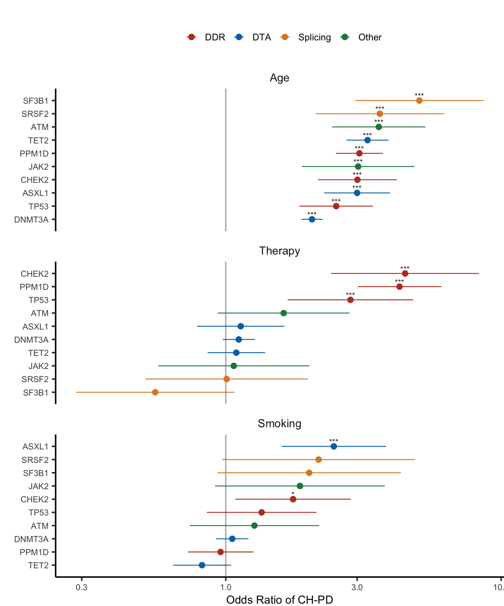

Genetic Mutations from Cancer Therapies
================
Kaitlyn Westra
11 December 2020

-   [Introduction](#introduction)
-   [Question](#question)
-   [Dataset](#dataset)
-   [Exploratory Data Analysis](#exploratory-data-analysis)
-   [Modeling](#modeling)
-   [Findings](#findings)
-   [Limitations](#limitations)
-   [Future Directions](#future-directions)
-   [Conclusions](#conclusions)
-   [Author](#author)
-   [Appendix](#appendix)

Introduction
------------

*Nature Genetics* is one of the most well-known and well-respected journals in the field of genetics. The work that these articles are based on reflect years of rigorous research, and presents some of the latest and greatest ideas in the field. Due to this, many experts regard getting published in the journal as a great achievement and frequently read these published articles.

Over the past 6 months, I've worked as a research intern at Grand Rapids' Van Andel Institute, in a [lab](https://braslab.vai.org) that studies the genetics of neurodegenerative diseases, like Parkinson's Disease, Alzheimer's Disease, and dementia with Lewy bodies. Throughout this internship, I have been able to learn about the intersection of genetics, disease, and data science, using R and other genomics tools to analyze genetic mutation data and make discoveries that have an impact on people's lives.

Because of this introduction I've had to the field of genetics and bioinformatics, I have been curious what *other* labs and groups do with similar data. This led me to browse through the [cBioPortal for Cancer Genomics](https://www.cbioportal.org), which I had heard about from a series of online [Dataviz + Cancer Microlabs](https://apply.hub.ki/cancerplusviz/) that occurred earlier this year. The dataset I had found was used in a recent *Nature Genetics* article, "[Cancer therapy shapes the fitness landscape of clonal hematopoiesis](https://www.nature.com/articles/s41588-020-00710-0)" so I decided this would be perfect for my final project.

Question
--------

#### Background

The story behind this article follows first author Kelly Bolton, a physician scientist (MD-PhD) and first year fellow in medical oncology at Memorial Sloan Kettering, the world’s oldest and largest private cancer center. Bolton was new to studying clonal hematopoiesis (CH), but jumped on the opportunity to research it, especially to understand if specific therapy types resulted in a higher frequency of CH. With her knowledge of epidemiology, she realized that she could use data from both electronic health records and sequential samples from patients, to understand how therapy could be promoting preexisting CH or inducing new mutations.

CH essentially happens when a hematopoietic stem cell, which can develop into different types of blood cells, starts making cells with the same genetic mutation in individuals without a blood disease. As such, clonal hematopoiesis [includes](https://www.ncbi.nlm.nih.gov/pmc/articles/PMC7065480/) the entire spectrum of premalignant conditions related to somatic mutations in genes associated with myeloid disorders. CH remains benign in most people, but sometimes progresses to malignancy.

Previously, studies have shown that certain types of chemotherapy lead to a higher risk of developing myeloid neoplasms (a class of clonal hematopoietic stem cell disorders), and also that the presence of clonal hematopoiesis increases the risk of developing these therapy-related myeloid neoplasm diseases (tMNs). Thus, the relationship between specific therapies and CH is important to investigate. Understanding this relationship can aid in the understanding of the mechanisms by which therapy-related myeloid diseases occur, and from there, can help develop interventions.

#### Project

With this project, I aim to replicate this lab's findings that mutations in genes are enriched based on specific exposures. Specifically, I will set out to verify that "**mutations in *ASXL1* are enriched in current or former smokers, whereas cancer therapy with radiation, platinum and topoisomerase II inhibitors preferentially selects for mutations in DNA damage response genes (*TP53*, *PPM1D*, *CHEK2*).**"

To do so, I will be recreating their **Figure 1c** using exactly the same data the authors used, and a combination of their published R code and some of my own original code. In this process, I will be thoroughly narrating my steps to give insight into the process and decisions that were made. Because a big part of data science and computer science is looking through others' code, understanding it, and adapting it to fit your needs, doing so with this available example will be an exercise in this skill. Being able to accomplish the objectives I have outlined herein demonstrate the knowledge I've gained this semester in DATA-202, and that I am equipped to practically apply this in new situations.

> *Much of the technical background information, including specific phrases, in this section was found in Bolton's [Nature Research blog post](https://cancercommunity.nature.com/posts/cancer-therapy-shapes-the-fitness-landscape-of-clonal-hematopoiesis).*

Dataset
-------

#### Dataset Background

``` r
M_wide_all = suppressWarnings(data.table::fread('./data/M_wide_all.txt', sep = '\t', header = T)) %>%
  as.data.frame()
```

The dataset used in Figure 1c is originally called `M_wide_all`. It contains brings together data on patients' demographics, exposures, and blood/tumor mutations. Used together, this information allows for correlations to be tested.

The `M_wide_all` dataset was obtained directly from the lab's available [Github repo](https://github.com/papaemmelab/bolton_NG_CH) for this project. Descriptions of how this data was originally acquired, though, are found in the Methods section of the published paper. While a comprehensive overview of the exact details can be found in the paper, a summary is provided here as well. Patients in the MSK-IMPACT cohort had nonhematologic cancers at Memorial Sloan Kettering (MSK) Cancer Center, and data on these patients' ancestry, smoking, date of birth and cancer history was extracted from the MSK cancer registry. Additional blood sample data was added from their Serial Sampling cohort. All participants underwent matched tumor and blood sequencing, which encompassed the exomes of all cancer-associated genes. After sequencing, variant calling for each blood sample was performed by various methods, and variants that were called by two callers were retained. Further, variants were annotated, leaving us with the dataset that appears to be `M_wide_all`.

> *Much of the technical methods information, including specific phrases, in this section was found in the [Nature Article](https://www.nature.com/articles/s41588-020-00710-0) itself.*

I am comfortable saying the data is reliable due to the fact that the authors followed standard scientific protocols, the study was reviewed and accepted by a Institutional Review Board, and the final paper was peer reviewed and published in a high impact journal. Additionally, because this data is from real patients in a well known cancer treatment / research institution, this data is applicable to the questions the authors set out to answer.

#### Dataset Description

`M_wide_all` contains 24146 rows, with 562 columns, making it an extremely large dataset. Because there are 24146 unique `STUDY_ID`s and 24146 rows in this dataset, we know that the `STUDY_ID` acts as a unique identifier for every row. Each row contains data from one patient and their blood/tumor, with columns for:
- their `STUDY_ID`
- the presence/number of mutations in each specific gene (`BRCA1`, `DNAJB1`, `ERBB4`, `FOXO1`, `TET2`, `TP53`, etc.)
- information about these mutations' variant allele fraction (`VAF_all`, `VAF_nonsilent`, `VAF_silent`, `VAF_my`, etc.)
- the number of different types of mutations (`mutnum_all`, `mutnum_nonsilent`, `mutnum_my`, etc.)
- the presence of clonal hematopoiesis mutations (`ch_nonmy`, `CH_nonsilent`, `ch_my_pd` \[PD being "putative cancer-driver mutations"\], etc.)
- demographic information about the patient (`Gender`, `race`, `age`)
- the patient's exposures (`therapy_known`, `therapy_binary`, `smoke`, `ind_cytotoxic_therapy`, `ind_ds_fluorouracil`, etc.).

This very large dataset is appropriate for answering the question answered in Figure 1c. As stated above, there are columns for mutations in many specific genes, which is what we are measuring. Additionally, there are columns for the exposures as well, including Therapy and Smoking. As these are the two primary things shown in Figure 1c, this dataset is applicable to our question of interest.

This dataframe is read in with `fread`, and most columns' data type is as expected. However, there are some instances where I think it would be best if the data were factors (many of the indicator variables or categories) but instead, they are coded as integers or strings. In all of our columns, the data types are broken down below:

<table style="width:36%;">
<colgroup>
<col width="16%" />
<col width="19%" />
</colgroup>
<thead>
<tr class="header">
<th align="center">Type</th>
<th align="center"># of Columns</th>
</tr>
</thead>
<tbody>
<tr class="odd">
<td align="center">character</td>
<td align="center">4</td>
</tr>
<tr class="even">
<td align="center">integer</td>
<td align="center">547</td>
</tr>
<tr class="odd">
<td align="center">numeric</td>
<td align="center">11</td>
</tr>
</tbody>
</table>

Some examples of variables I think should be renamed include:

<table style="width:68%;">
<colgroup>
<col width="30%" />
<col width="20%" />
<col width="16%" />
</colgroup>
<thead>
<tr class="header">
<th align="center">Variable</th>
<th align="center">Current Type</th>
<th align="center">Ideal Type</th>
</tr>
</thead>
<tbody>
<tr class="odd">
<td align="center">Gender</td>
<td align="center">character</td>
<td align="center">factor</td>
</tr>
<tr class="even">
<td align="center">ind_ds_fluorouracil</td>
<td align="center">integer</td>
<td align="center">factor</td>
</tr>
<tr class="odd">
<td align="center">age_cat</td>
<td align="center">integer</td>
<td align="center">factor</td>
</tr>
<tr class="even">
<td align="center">smoke</td>
<td align="center">integer</td>
<td align="center">factor</td>
</tr>
</tbody>
</table>

As seen in the table above, I would change most datatypes to factor, which could be easily done with the `data.table::fread()` option, `stringsAsFactors = TRUE`. It would make sense to change these to factors due to their use in this analysis -- `Gender` was essentially considered a factor, with the following options: Female, Male, and the indicator variables (like `ind_ds_fluorouracil`) having the following levels: 0, 1. I am unsure of why they chose to leave strings as characters, but because it doesn't really affect the analysis, this isn't an imperative issue.

With the knowledge of which variable names are included in this dataset, it makes sense to explore individual variables further and determine what they mean, what the distribution looks like, and how they're related to other variables. This allows us to to make choices about how to further interpret and analyze this data, as well as give some ideas on which data wrangling steps need to be taken.

Exploratory Data Analysis
-------------------------

#### Univariate EDA

In `M_wide_all`, it appears as if some preprocessing steps have already been taken, such as adding a column for the age categories -- breaking down each person's exact decimal age, into an age bracket. To explore how these age categories are broken down, I created the following table and bar graph:

<table style="width:42%;">
<colgroup>
<col width="16%" />
<col width="25%" />
</colgroup>
<thead>
<tr class="header">
<th align="center">Age Group</th>
<th align="center">Number of People</th>
</tr>
</thead>
<tbody>
<tr class="odd">
<td align="center">1</td>
<td align="center">337</td>
</tr>
<tr class="even">
<td align="center">2</td>
<td align="center">297</td>
</tr>
<tr class="odd">
<td align="center">3</td>
<td align="center">708</td>
</tr>
<tr class="even">
<td align="center">4</td>
<td align="center">1519</td>
</tr>
<tr class="odd">
<td align="center">5</td>
<td align="center">3177</td>
</tr>
<tr class="even">
<td align="center">6</td>
<td align="center">5788</td>
</tr>
<tr class="odd">
<td align="center">7</td>
<td align="center">7074</td>
</tr>
<tr class="even">
<td align="center">8</td>
<td align="center">4219</td>
</tr>
<tr class="odd">
<td align="center">9</td>
<td align="center">1027</td>
</tr>
</tbody>
</table>


From this table and bar graph, we know that there are 9 different age categories, each with the specified number of people. This distribution is left-skewed, and most people appear to be in the higher numbered age groups.

To gain an understanding of what ages are included in each group, I made the following exploratory plot:


As shown above, the age cutoffs for each category are: 0.128679, 11.093771, 21.0047913, 31.0006847, 41.0047913, 51.0061607, 61.0020523, 71.0006866, 81.0047913, indicating that they chose 0, 11, 21, 31, 41, 51, 61, 71, 81 as their minimum ages for each age group. These cutoffs appear in grey dashed lines on the series of boxplots, demonstrating that these categories are chosen based on age itself, as opposed to having category containing the same number of people (e.g., 9 quantiles). The violin plot shown demonstrates how many samples are included in the entire dataset, by age, aligned with the violin plots to give a insight into the comparative amount of patients in each group.

Some of the other variables that are primarily used to create Figure 1c are `race`, `mutnum_all`, `smoke`, `Gender`, and `therapy_binary`. However, before creating the figure, they "process dataframes a bit", which I'll walk through next.

#### Data Wrangling

The following code displays the main data wrangling steps used on this data. Below, I explain what this code does, and how it impacts the rest of the analysis.

``` r
M_wide_all = M_wide_all %>%
    mutate(race_b = as.integer(race == "White")) %>%
    mutate(age_scaled = as.vector(scale(age)),
           age_d=age/10) %>%
    mutate(mutnum_all_r = case_when(
      mutnum_all == 0 ~ 0,
      mutnum_all == 1 ~ 1,
      mutnum_all >= 2 ~ 2)) %>%
    mutate(smoke_bin=case_when(
      smoke==0 ~ 0,
      smoke==1 ~ 1,
      smoke==2 ~ 1)) %>%
    mutate(
      Gender = relevel(factor(Gender), ref = 'Male'),
      race = relevel(factor(race), "White"),
      smoke = relevel(factor(smoke), "0"),
      smoke_bin = relevel(factor(smoke_bin), "0"),
      therapy_binary = relevel(factor(therapy_binary), 'untreated')
    )
```

This step of consecutive mutating essentially makes many of the variables of interest into binary factors, which is similar to what I had suggested with the original dataframe. In these above steps, the following variables are created:

-   `race_b`: a binary version of `race`, with a value of 1 for "White", and a 0 for anything else.
-   `age_scaled`: the `age` value, centered (by subtracting the mean `age`) and scaled (by dividing the centered `age` by its standard deviation).
-   `age_d`: simply takes the `age` value and divides it by 10.
-   `mutnum_all_r`: the number of mutations, with a value of 2 for any individual with 2+ mutations.
-   `smoke_bin`: a binary version of `smoke`, with a value of 1 if patient is a current (`smoke` value of 1) or former (`smoke` value of 2) smoker

In the last step of the above code, the variables `Gender`, `race`, `smoke`, `smoke_bin`, and `therapy_binary` are factored and releveled with specific references. - Reference values are important when modelling because any differences are in comparison to the reference category. Because its the basis for which values are compared to, this can change the interpretation of the results.
- After releveling, the resulting base level for the following values are:
<ul>
-   `Gender`: Male
-   `race`: White
-   `smoke`: 0 (never smoker)
-   `smoke_bin`: 0 (never smoker)
-   `therapy_binary`: untreated (no cancer directed therapy during interval other than hormonal therapy)

</ul>
To observe some of these changes, we'll look at what two these variables look like before and after the change:

**Number of Mutations**

Originally, the number of mutations, `mutnum_all`, is broken down into 9 categories. The new variable, `mutnum_all_r`, only has 3 categories. By comparing the breakdowns, we see that any people with more than 2 mutations have been included in the `mutnum_all_r` "2" category. Below is the breakdown of these two variables:

<table style="width:56%;">
<caption>mutnum_all</caption>
<colgroup>
<col width="30%" />
<col width="25%" />
</colgroup>
<thead>
<tr class="header">
<th align="center">Number of Mutations</th>
<th align="center">Number of People</th>
</tr>
</thead>
<tbody>
<tr class="odd">
<td align="center">0</td>
<td align="center">16930</td>
</tr>
<tr class="even">
<td align="center">1</td>
<td align="center">4952</td>
</tr>
<tr class="odd">
<td align="center">2</td>
<td align="center">1544</td>
</tr>
<tr class="even">
<td align="center">3</td>
<td align="center">496</td>
</tr>
<tr class="odd">
<td align="center">4</td>
<td align="center">158</td>
</tr>
<tr class="even">
<td align="center">5</td>
<td align="center">46</td>
</tr>
<tr class="odd">
<td align="center">6</td>
<td align="center">14</td>
</tr>
<tr class="even">
<td align="center">7</td>
<td align="center">5</td>
</tr>
<tr class="odd">
<td align="center">8</td>
<td align="center">1</td>
</tr>
</tbody>
</table>

<table style="width:56%;">
<caption>mutnum_all_r</caption>
<colgroup>
<col width="30%" />
<col width="25%" />
</colgroup>
<thead>
<tr class="header">
<th align="center">Number of Mutations</th>
<th align="center">Number of People</th>
</tr>
</thead>
<tbody>
<tr class="odd">
<td align="center">0</td>
<td align="center">16930</td>
</tr>
<tr class="even">
<td align="center">1</td>
<td align="center">4952</td>
</tr>
<tr class="odd">
<td align="center">2</td>
<td align="center">2264</td>
</tr>
</tbody>
</table>

**Age Scaling**

In the plot below, the distribution of `age` is shown on top of the distribution of `age_scaled`. The distribution itself is the same, but the age values change (due to the centering and scaling). To see the new values, note the different x-axis value range for `age_scaled`.


In addition to `age_scaled` and `mutnum_all_r`, the variables that are used in Figure 1c include `smoke_bin`, `race_b`, `Gender`, and `therapy_binary`.

**Smoke Binned**

In the processing code above, we saw that `smoke_bin` has a value of 1 if patient is a current (`smoke` value of 1) or former (`smoke` value of 2) smoker, and a 0 if they have never been a smoker. The number of people in each of these categories is shown below, demonstrating that there is a similar amount of people who are current/former smokes and have never smoked.


**Race Binary**

`race_b` was also created in the processing code shown above, as a binary version of `race` with a value of 1 for "White", and a 0 for anything else. The amount of people that fall into each of these categories is shown below, with the majority of patients in this study being white.


**Gender**

`Gender` is a factor with one of two values: Male or Female. Here is the breakdown for participants in this study, displaying a comparable number of each gender, with slightly more females.


**Therapy Binary**

Lastly, `therapy_binary` indicates if the patient had any cancer directed therapy other than hormonal therapy. Based on the distribution below, it is evident that for most of the original patients, it was unknown whether or not they had therapy during the interval. Of the patients where their therapy status was known, there were more treated patients than untreated.


From this point in the authors' code, the dataset was subsetted to create a new dataset:

``` r
#Define wide data frame with treatment known
M_wide <- M_wide_all %>% filter(therapy_known==1)
```

This newly created dataset, `M_wide`, contains only the rows where the therapy information is known. This is an appropriate way to identify and deal with missing data, which is necessary due to the large amount of patients with unknown therapy history, as shown in the plot above. Subsetting this dataset into `M_wide` ensures that the data we're using contains all the information we need, and allows for the comparisons to be made.

#### Bivariate EDA

To do some exploratory bivariate data analysis, I made a series of quick plots to see what relationships might be present between our variables of interest.

I am first looking at the relationship between the presence of mutations in the gene *TP53* (`TP53`) and whether the patient received therapy (`therapy_binary`) during this period. Because these are each binary variables, it really only makes sense to calculate the odds ratio, but to show this same idea in a figure, the number of people that belong to each of these categories is shown in a 2-by-2 table. From this, we see that there seems to be a higher percentage of people with *TP53* mutations in the treated group than the untreated group:


Similarly, we can make the same plot for `smoke_bin` and the mutations in the gene *ASXL1* (`ASXL1`). From this, we see that there seems to be a higher percentage of current/former smokers (`smoke_bin` == 1) with mutations in *ASXL1* compared to non-smokers:


Just out of curiosity, we'll check the same thing -- if the presence of mutations correlates with smoking status -- in a *different* gene: *TET2*. Based on Figure 1c, I'd expect this not to show a significant difference between the groups. As expected, the figure below shows that there doesn't appear to be a significantly higher amount of current/former smokers with new mutations in this gene compared to non-smokers:


All of these bivariate plots give us some insight into what we expect to see with the model we create, and the odds ratio we'll be calculating. These plots don't adjust or control for any variables though, so this is something to keep in mind as we move forward.

Modeling
--------

From the figure legend, we see that the question in Figure 1c is whether *specific molecular subtypes of CH-PD correlate with age, previous therapy exposure and smoking history*. The authors answer this question by creating *multivariable logistic regression models adjusted for therapy, smoking, ancestry, age, sex and time from diagnosis to blood draw.* In Figure 1c, they display the odds ratio with its 95% confidence interval for CH-PD mutations in the ten most commonly mutated genes. They show three consecutive forest plots displaying different groups compared; for the top, increasing age (n = 10,138); middle, patients previously exposed to cancer therapy (n = 5,978) compared with those with no exposure (n = 4,160); bottom, current/former smokers (n = 4,989) compared with nonsmokers (n = 5,145). Significance levels are determined by Q values (FDR-corrected P values): \* Q &lt; 0.05, \*\* Q &lt; 0.01, \*\*\* Q &lt; 0.001.

#### Pre-modeling Setup

To start, though, some other setup needs to occur. This setup selects specific genes of interest, and the code for this step is as follows:

``` r
## forest plot
DTA = c('DNMT3A', 'TET2', 'ASXL1')
DDR = c('PPM1D', 'TP53', 'CHEK2')
SPL = c('SF3B1', 'SRSF2')
OTH = c('JAK2', 'ATM')

gene_list = c(DDR, DTA, SPL, OTH)
```

From the article, we know that these genes were selected based on their biochemical pathway. A brief description of the pathway is shown below:

<table style="width:85%;">
<colgroup>
<col width="13%" />
<col width="38%" />
<col width="31%" />
</colgroup>
<thead>
<tr class="header">
<th align="center">Pathway</th>
<th align="left">Function</th>
<th align="center">Selected Genes</th>
</tr>
</thead>
<tbody>
<tr class="odd">
<td align="center">DTA</td>
<td align="left">epigenetic modifiers</td>
<td align="center"><em>DNMT3A, TET2, ASXL1</em></td>
</tr>
<tr class="even">
<td align="center">DDR</td>
<td align="left">DNA damage response genes</td>
<td align="center"><em>PPM1D, TP53, CHEK2</em></td>
</tr>
<tr class="odd">
<td align="center">SPL</td>
<td align="left">spliceosome genes</td>
<td align="center"><em>SF3B1, SRSF2</em></td>
</tr>
<tr class="even">
<td align="center">OTH</td>
<td align="left">other</td>
<td align="center"><em>JAK2, ATM</em></td>
</tr>
</tbody>
</table>

All of these pathway functions are pretty clear, except the "other" category. I couldn't find any reason in the article or code for why these 2 genes (*JAK2* and *ATM*) specifically were included. Looking through journal articles revealed that *ATM* is in a [key DDR-related pathway for "critical DNA damage response kinases"](https://www.ncbi.nlm.nih.gov/pmc/articles/PMC5961503/), and that mutations in *JAK2* have previously been [found in patients with myeloproliferative disorders](https://www.nature.com/articles/nature03546). Because of these previous studies, it would make sense that these two extra genes were included. However, I think it would have been better if a more thorough explanation had detailed why these two "other genes" were selected, instead of it being a seemingly haphazard choice.

#### Model Creation

The next bit of code creates models for each of the genes of interest. It looks as follows:

``` r
#ALL adjusted for treatment
logit_gene_var = list()

for (gene in gene_list) {
    logit = glm(
        formula = get(gene) ~ age_scaled + smoke_bin + race_b + Gender + therapy_binary,
        data = M_wide,
        family = "binomial")
    logit_data = logit %>% sjPlot::get_model_data(type="est") %>% cbind(Gene = gene)
    logit_gene_var = rbind(logit_gene_var, logit_data)
}
```

To break down what this code is doing, the first line starts out by making an empty list, `logit_gene_var`, that will eventually contain all the data on the predictors from the created models. Then, for each of the 10 genes in the `gene_list` that was previously created, a Binomial Regression Model (a type of Generalized Linear Model) is created, predicting `gene` from the variables `age_scaled`, `smoke_bin`, `race_b`, `Gender`, and `therapy_binary`. The model uses the Binomial error distribution, which is a discrete distribution where the outcomes are 0 and 1.

To verify that the binomial model is what we should be using, we'll make sure that each of our genes has values of either 0 or 1:

<table style="width:33%;">
<colgroup>
<col width="33%" />
</colgroup>
<thead>
<tr class="header">
<th align="center">Gene Values</th>
</tr>
</thead>
<tbody>
<tr class="odd">
<td align="center">Values for PPM1D: 0:1</td>
</tr>
<tr class="even">
<td align="center">Values for TP53: 0:1</td>
</tr>
<tr class="odd">
<td align="center">Values for CHEK2: 0:1</td>
</tr>
<tr class="even">
<td align="center">Values for DNMT3A: 0:1</td>
</tr>
<tr class="odd">
<td align="center">Values for TET2: 0:1</td>
</tr>
<tr class="even">
<td align="center">Values for ASXL1: 0:1</td>
</tr>
<tr class="odd">
<td align="center">Values for SF3B1: 0:1</td>
</tr>
<tr class="even">
<td align="center">Values for SRSF2: 0:1</td>
</tr>
<tr class="odd">
<td align="center">Values for JAK2: 0:1</td>
</tr>
<tr class="even">
<td align="center">Values for ATM: 0:1</td>
</tr>
</tbody>
</table>

Because all of these contain values of only 0 or 1, we can go ahead with our binomial model.

The last two lines of code in this chunk take our model, `logit`, and gets data from its forest-plot of estimates. This contains details about each predictor, with the columns: term, estimate, std.error, conf.low, conf.high, statistic, den.df, p.value, p.stars, p.label, group, xpos, xmin, xmax. From here, an additional column is added with the gene name. This dataframe is then added to a larger dataframe, `logit_gene_var`, which contains rows for each predictor variable for each gene. This combined dataframe has 50 rows (10 genes \* 5 predictor variables).

I am a bit curious why `cbind` was used instead of `mutate` to add the gene name to all of these rows. Previous code by these authors reveals ubiquitous use of `dplyr` functions, so simply adding a column with a string seems easily done with `mutate`. Doing so with `cbind` seems unconventional, so I wonder if there's any reason why these authors chose it over `mutate`. Perhaps it's simply what first came to mind.

#### Modeling Results Dataset

From this point, the authors use the data from these models to create the figure. However, before this, the function `signif.num` needs to be defined. This comes from a script, `toolbox.R`, that is included in the Github repo. This is `source()`d in the "Reviewer\_Code.Rmd" document that I'm walking through, which allows forany of these manually defined functions to be used in the script. Below is the defintion of `signif.num()`:

``` r
signif.num <- function(x, ns = FALSE) {
    if (ns) {
        symbols = c("***", "**", "*", "ns")
    } else {
        symbols = c("***", "**", "*", "")
    }
    
    symnum(unlist(x), corr = FALSE, na = FALSE, legend = FALSE,
           cutpoints = c(0, 0.001, 0.01, 0.05, 1), 
           symbols = symbols)
}
```

To quickly summarize what this is doing, `signif.num` takes a list, `x`, and assigns a significance level to the items within it, depending on the value of each item. This, specifically, assigns the following values:

<table style="width:53%;">
<colgroup>
<col width="25%" />
<col width="27%" />
</colgroup>
<thead>
<tr class="header">
<th align="center">Range of Values</th>
<th align="center">Significance Level</th>
</tr>
</thead>
<tbody>
<tr class="odd">
<td align="center">0 - 0.001</td>
<td align="center">***</td>
</tr>
<tr class="even">
<td align="center">0.001 - 0.01</td>
<td align="center">**</td>
</tr>
<tr class="odd">
<td align="center">0.01 - 0.05</td>
<td align="center">*</td>
</tr>
<tr class="even">
<td align="center">0.05 - 1</td>
<td align="center">ns or ''</td>
</tr>
</tbody>
</table>

#### Exact Figure Dataset

Now that the function has been defined, we're ready to move on to create the specific dataframe used in Figure 1c. This code for this is shown below:

``` r
# for each gene
D = logit_gene_var %>%
    filter(!term %in% c("GenderFemale", "race_b")) %>%
    mutate(
        term = c(
            'therapy_binarytreated' = 'Therapy',
            'smoke_bin1' = 'Smoking',
            'age_scaled' = 'Age'
        )[as.character(term)]
    ) %>%
    mutate(term = factor(term, c("Age", "Therapy", "Smoking"))) %>%
    mutate(p_fdr = p.adjust(p.value, method = "fdr")) %>%
    mutate(termGene = paste0(term, Gene)) %>%
    arrange(estimate, Gene) %>%
    mutate(termGene = factor(termGene, levels = termGene)) %>%
    mutate(gene_cat = case_when(
        Gene %in% DTA ~ 'DTA', 
        Gene %in% DDR ~ 'DDR', 
        Gene %in% SPL ~ 'Splicing', 
        T ~ 'Other'
      )
    ) %>% 
    mutate(gene_cat = factor(gene_cat, c('DDR', 'DTA', 'Splicing', 'Other'))) %>%
    mutate(
        q.value = p.adjust(p.value, n = nrow(.), method = 'fdr'), 
        q.label = paste0(signif(estimate, 2), signif.num(q.value)),
        q.star = signif.num(q.value)
    )

#FIXTHIS DELETE
print(D)
```

    ##       term  estimate  std.error  conf.low conf.high   statistic den.df
    ## 1  Therapy 0.5546006 0.33796215 0.2859607  1.075608 -1.74429920    Inf
    ## 2  Smoking 0.8200258 0.12363785 0.6435567  1.044884 -1.60484410    Inf
    ## 3  Smoking 0.9574955 0.14008012 0.7276128  1.260008 -0.31006747    Inf
    ## 4  Therapy 1.0077691 0.34642966 0.5110690  1.987204  0.02233952    Inf
    ## 5  Smoking 1.0557788 0.06904873 0.9221436  1.208780  0.78609313    Inf
    ## 6  Therapy 1.0690663 0.32214618 0.5685823  2.010092  0.20731465    Inf
    ## 7  Therapy 1.0922160 0.12278401 0.8586074  1.389385  0.71840530    Inf
    ## 8  Therapy 1.1148707 0.06823799 0.9753045  1.274409  1.59351724    Inf
    ## 9  Therapy 1.1334621 0.18630948 0.7867198  1.633029  0.67241237    Inf
    ## 10 Smoking 1.2710092 0.27622281 0.7396519  2.184087  0.86818027    Inf
    ## 11 Smoking 1.3498264 0.23375133 0.8537062  2.134260  1.28331246    Inf
    ## 12 Therapy 1.6226709 0.28096392 0.9355641  2.814410  1.72290275    Inf
    ## 13 Smoking 1.7558998 0.24667828 1.0827465  2.847559  2.28224979    Inf
    ## 14 Smoking 1.8593155 0.36220819 0.9141994  3.781510  1.71229811    Inf
    ## 15 Smoking 2.0079923 0.39143275 0.9323391  4.324642  1.78098380    Inf
    ## 16     Age 2.0566534 0.04498379 1.8830889  2.246215 16.02977622    Inf
    ## 17 Smoking 2.1727015 0.41148217 0.9699421  4.866921  1.88579569    Inf
    ## 18 Smoking 2.4681387 0.22287885 1.5946110  3.820185  4.05361172    Inf
    ## 19     Age 2.5173710 0.15686213 1.8510832  3.423486  5.88551915    Inf
    ## 20 Therapy 2.8363443 0.26775174 1.6782175  4.793687  3.89359191    Inf
    ## 21     Age 2.9980980 0.14031657 2.2772366  3.947149  7.82500682    Inf
    ## 22     Age 3.0066870 0.16782888 2.1638743  4.177769  6.55929322    Inf
    ## 23     Age 3.0255808 0.24034273 1.8889856  4.846061  4.60635146    Inf
    ## 24     Age 3.0558576 0.10026324 2.5106657  3.719438 11.14127409    Inf
    ## 25     Age 3.2711197 0.08973571 2.7435524  3.900135 13.20691984    Inf
    ## 26     Age 3.5949385 0.19887186 2.4345092  5.308496  6.43392609    Inf
    ## 27     Age 3.6257729 0.27341197 2.1216411  6.196255  4.71108669    Inf
    ## 28 Therapy 4.2758367 0.17857336 3.0131392  6.067685  8.13659884    Inf
    ## 29 Therapy 4.4798721 0.31485362 2.4169170  8.303659  4.76283079    Inf
    ## 30     Age 5.0469606 0.27399009 2.9499124  8.634769  5.90819244    Inf
    ##         p.value p.stars  p.label group xpos  xmin  xmax   Gene        p_fdr
    ## 1  8.110693e-02            0.55    neg    1 0.825 1.175  SF3B1 1.302626e-01
    ## 2  1.085281e-01            0.82    neg    4 3.825 4.175   TET2 1.514239e-01
    ## 3  7.565096e-01            0.96    neg    4 3.825 4.175  PPM1D 8.105461e-01
    ## 4  9.821771e-01            1.01    pos    1 0.825 1.175  SRSF2 9.821771e-01
    ## 5  4.318129e-01            1.06    pos    4 3.825 4.175 DNMT3A 5.181755e-01
    ## 6  8.357641e-01            1.07    pos    1 0.825 1.175   JAK2 8.645836e-01
    ## 7  4.725074e-01            1.09    pos    1 0.825 1.175   TET2 5.452009e-01
    ## 8  1.110442e-01            1.11    pos    1 0.825 1.175 DNMT3A 1.514239e-01
    ## 9  5.013212e-01            1.13    pos    1 0.825 1.175  ASXL1 5.570236e-01
    ## 10 3.852957e-01            1.27    pos    4 3.825 4.175    ATM 4.816196e-01
    ## 11 1.993826e-01            1.35    pos    4 3.825 4.175   TP53 2.600643e-01
    ## 12 8.490611e-02            1.62    pos    1 0.825 1.175    ATM 1.302626e-01
    ## 13 2.247460e-02       *   1.76 *   pos    4 3.825 4.175  CHEK2 4.494919e-02
    ## 14 8.684175e-02            1.86    pos    4 3.825 4.175   JAK2 1.302626e-01
    ## 15 7.491510e-02            2.01    pos    4 3.825 4.175  SF3B1 1.302626e-01
    ## 16 7.916732e-58     *** 2.06 ***   pos    5 4.825 5.175 DNMT3A 2.375020e-56
    ## 17 5.932249e-02            2.17    pos    4 3.825 4.175  SRSF2 1.112297e-01
    ## 18 5.043290e-05     *** 2.47 ***   pos    4 3.825 4.175  ASXL1 1.163836e-04
    ## 19 3.968064e-09     *** 2.52 ***   pos    5 4.825 5.175   TP53 1.322688e-08
    ## 20 9.877076e-05     *** 2.84 ***   pos    1 0.825 1.175   TP53 2.116516e-04
    ## 21 5.076294e-15     *** 3.00 ***   pos    5 4.825 5.175  ASXL1 3.045776e-14
    ## 22 5.406340e-11     *** 3.01 ***   pos    5 4.825 5.175  CHEK2 2.703170e-10
    ## 23 4.097956e-06     *** 3.03 ***   pos    5 4.825 5.175   JAK2 1.024489e-05
    ## 24 7.898126e-29     *** 3.06 ***   pos    5 4.825 5.175  PPM1D 7.898126e-28
    ## 25 8.003287e-40     *** 3.27 ***   pos    5 4.825 5.175   TET2 1.200493e-38
    ## 26 1.243493e-10     *** 3.59 ***   pos    5 4.825 5.175    ATM 5.329258e-10
    ## 27 2.463994e-06     *** 3.63 ***   pos    5 4.825 5.175  SRSF2 6.719983e-06
    ## 28 4.065370e-16     *** 4.28 ***   pos    1 0.825 1.175  PPM1D 3.049027e-15
    ## 29 1.908959e-06     *** 4.48 ***   pos    1 0.825 1.175  CHEK2 5.726877e-06
    ## 30 3.458818e-09     *** 5.05 ***   pos    5 4.825 5.175  SF3B1 1.297057e-08
    ##         termGene gene_cat      q.value q.label q.star
    ## 1   TherapySF3B1 Splicing 1.302626e-01    0.55       
    ## 2    SmokingTET2      DTA 1.514239e-01    0.82       
    ## 3   SmokingPPM1D      DDR 8.105461e-01    0.96       
    ## 4   TherapySRSF2 Splicing 9.821771e-01       1       
    ## 5  SmokingDNMT3A      DTA 5.181755e-01     1.1       
    ## 6    TherapyJAK2    Other 8.645836e-01     1.1       
    ## 7    TherapyTET2      DTA 5.452009e-01     1.1       
    ## 8  TherapyDNMT3A      DTA 1.514239e-01     1.1       
    ## 9   TherapyASXL1      DTA 5.570236e-01     1.1       
    ## 10    SmokingATM    Other 4.816196e-01     1.3       
    ## 11   SmokingTP53      DDR 2.600643e-01     1.3       
    ## 12    TherapyATM    Other 1.302626e-01     1.6       
    ## 13  SmokingCHEK2      DDR 4.494919e-02    1.8*      *
    ## 14   SmokingJAK2    Other 1.302626e-01     1.9       
    ## 15  SmokingSF3B1 Splicing 1.302626e-01       2       
    ## 16     AgeDNMT3A      DTA 2.375020e-56  2.1***    ***
    ## 17  SmokingSRSF2 Splicing 1.112297e-01     2.2       
    ## 18  SmokingASXL1      DTA 1.163836e-04  2.5***    ***
    ## 19       AgeTP53      DDR 1.322688e-08  2.5***    ***
    ## 20   TherapyTP53      DDR 2.116516e-04  2.8***    ***
    ## 21      AgeASXL1      DTA 3.045776e-14    3***    ***
    ## 22      AgeCHEK2      DDR 2.703170e-10    3***    ***
    ## 23       AgeJAK2    Other 1.024489e-05    3***    ***
    ## 24      AgePPM1D      DDR 7.898126e-28  3.1***    ***
    ## 25       AgeTET2      DTA 1.200493e-38  3.3***    ***
    ## 26        AgeATM    Other 5.329258e-10  3.6***    ***
    ## 27      AgeSRSF2 Splicing 6.719983e-06  3.6***    ***
    ## 28  TherapyPPM1D      DDR 3.049027e-15  4.3***    ***
    ## 29  TherapyCHEK2      DDR 5.726877e-06  4.5***    ***
    ## 30      AgeSF3B1 Splicing 1.297057e-08    5***    ***

``` r
print(typeof(D))
```

    ## [1] "list"

``` r
print(class(D))
```

    ## [1] "data.frame"

To create this dataframe, `D`, we start with the previous dataframe, `logit_gene_var` that contains all of the information of the predictiors of our 10 gene models. The first two lines filter out the rows where the term is `GenderFemale` or `race_b`. Including them in the model, but excluding them from the subsequent analysis ensures that they are controlled for.

The next mutate step renames the predictor terms from more technical language (`therapy_binarytreated`, `smoke_bin1`, and `age_scaled`) to more broadly understandable terms (`Therapy`, `Smoking`, and `Age`) to be included in the figures. Next, this `term` column is changed into the factor type, with each of these three values as a level.

After this, a new column, `p_fdr` is created, which adjusts the p-values for multiple comparisons using the Benjamini & Hochberg (1995) correction method with `p.adjust`. This correction is necessary when doing multiple large scale comparisons, to ensure that the significance you're seeing isn't simply due to chance. Additionally, another new column `termGene` is made which takes each row's gene name and appends it to the end of the term.

Next, this dataframe is sorted from lowest `estimate` value, which is approximately the effect the term has on the overall prediction. In the case of a tie between `estimate` values, the rows are then sorted by `Gene` name. Then, the type of the previously created `termGene` is changed from a character to a factor.

Subsequently, a `gene_cat` is added, with the value of "DTA" or "DDR" if the gene is involved in one of these commonly understood pathways, with the value of "Splicing" if it's a spliceosome gene, and with a value of "Other" if the gene is in none of these lists. Then `gene_cat` is factored.

After this, the significance estimates are determined. The `q.value` becomes the fdr adjusted p-value; the `q.label` rounds the estimate to the nearest 0.01 along with the q-value; and `q.star` is the resulting significance level in stars.

Interestingly, it seems as though they began adjusting their p-values when they create `p_fdr`, but then move on to other things and come back to do this same thing at the end of this code chunk. This makes it seem like the authors did not clearly look over their code to assess what each of their steps are doing. In fact, looking over the rest of entire `Reviewer_Code.Rmd` reveals that they did not use this `p_fdr` column of this dataset for anything else. This finding speaks to the importance of understanding what your code does, instead of being at a point where you accidentally do the same thing twice.

Additionally, the order of these steps doesn't seem to be the most logical. For example, `termGene` seems to be created at an artibrary point in the process, and is later revisted to be factored. I personally think it would've made more sense to reviewers or others reading this code if the authors had factored `termGene` directly after creating it, and done everything p-value related at the same time point. However, this makes no different on the dataframe itself, so there is nothing technically wrong with it. Yet, data scientists should strive to make their code hospitable to all those reading it. Being considerate of even the little things, such as logically grouping similar `mutate()`s together, can help others understand *why* a certain choice was made, or see the significance of a specific step. Though most of the code is still pretty clear, this is one area where I think these authors could improve.

#### Create Figure

The last step needed to make Figure 1c is to take the dataframe we just set up and actually make the figure! The code for this step is shown below:

``` r
# ggplot(D) + #, aes_string(x = "termGene", y = "estimate", ymin = "conf.low", ymax = "conf.high", col = 'gene_cat', fill = NULL)) +
#     geom_blank() #+

# ggplot(D, aes_string(x = "termGene", y = "estimate", ymin = "conf.low", ymax = "conf.high", col = 'gene_cat', fill = NULL)) + 
#     geom_blank() #+
    # geom_hline(yintercept = 1, color = "gray", linetype = "solid") +
    # geom_errorbar(position = position_dodge(width = .8), width = 0, size=0.3) + 
    # geom_point(position = position_dodge(width = .8), size=1.5) +
    # geom_text(aes_string(label = "p.label", vjust = 0), position = position_dodge(width = .8), color = 'black', size = 2, alpha = .9) +
    # coord_flip() +
    # ggtitle("")
```

``` r
p_forest <- plot_forest(
      class_results = D,
      x = "termGene",
      label = 'q.star',
      eb_w = 0,
      eb_s = 0.3,
      ps = 1.5,
      or_s = 2,
      nudge = -0.3,
      col = 'gene_cat'
  ) +
facet_wrap(~term, scale = 'free_y', ncol = 1) +
scale_x_discrete(
    breaks = D$termGene,
    labels = D$Gene,
    expand = c(0.1,0)
) +
xlab('') + ylab('Odds Ratio of CH-PD') +
scale_color_nejm() +
panel_theme +
theme(
  axis.text = element_text(size = font_size),
  axis.title = element_text(size = font_size),
  strip.text = element_text(size = font_size),
  legend.position = 'top',
  legend.title = element_blank(),
  legend.text = element_text(size = font_size/1.2),
  legend.key.size = unit(3, "mm")
)
```

This plot starts off by calling `plot_forest()`, another function defined in `toolbox.R`. For the sake of this project, instead of walking through how the function works, I'll simply discuss only what arguments are used here. `D`, our previously-created dataframe, contains all the data needed for this plot. The plot eventually undergoes a `coord_flip()` as part of the `plot_forest()` function, so "x" is our "termGene", which is resultingly on the *y*-axis. "y" defaults to "estimate", so this is what is shown on the final *x*-axis. The annotation above each of the lines is the star values, from `q.star`; the `eb_w` and `eb_s` are the width and size of the error bars; the `ps` is the size of the point; the `or_s` is the size of the label text; the `nudge` is the vertical offset of the label text; and the `col` is the color of each line, colored by its gene category.

After this, the whole plot is broken up into 3 sub-plots, based on the value of `term`, resulting in one for each of "Age", "Therapy", and "Smoking". Additionally, the x-axis scale becomes the name of each gene. The x-axis is unlabeled, and the y-axis label gets defined. A color palette, inspired by plots in *The New England Journal of Medicine*, is chosen from the `ggsci` package. The general appearance of the plot is specified with `panel_theme`, which is defined previously in `Revier_Code.Rmd` and used in other plots. Lastly, some additional appearance changes are made specific to this plot.

Finally, `do_plot()` makes the plot and saves it with the specified dimensions:

``` r
do_plot(p_forest, "my_fig1c.png", 5, 6, save_pdf = F)
```

    ## Don't know how to automatically pick scale for object of type noquote. Defaulting to continuous.



And there it is! Our final version of Figure 1c.

Findings
--------

\[FIXTHIS: pick up on rubric here... **Discussion of findings**\]

Summarize the analyses you performed and what the results told you. What do your findings say about the real-world and prediction (or clustering) questions you posed?

-   3pts: *Particular thought or insight was given to how the findings connect to the questions*
-   2pts: *Results are summarized in a way that clearly connects to the questions that were posed*

Limitations
-----------

What are some limitations of your analyses and potential biases of the data you used?

and Ethical Considerations

-   3pts: *Particular thought was given to identifying and characterizing limitations*
-   2pts: *includes a coherent discussion of limitations and potential biases of the data, analysis approach, or other aspects* -- not "superficial or limited"

Future Directions
-----------------

What new questions came up following your exploration of this data? Describe at least one question that could not be answered using your data alone, and specify what additional data you would collect to address it.

-   3pts: *Identifies multiple questions, or particularly thoughtful questions*
-   2pts: *identifies at least one question that would require new data or a new analysis approach, and specifies what steps would be required*
-   maybe pull something from *their* future directions section & discuss what type of data would be necessary for this?
-   discuss what the rest of the analysis and figures go on to show... and what extra data is needed for this?

Conclusions
-----------

> this is my own added section. see if I want to include this or not. if not, put this paragraph somewhere else

FIXTHIS: go back & take a look @ EDA plots. Decide if you want to keep the 0s and 1s, or change it to be the *actual* thing it *means*. I think that might be better for the sake of easy-reading. My text can still explain the 0s and 1s.

In addressing this question, I gained not only an understanding of how data science is used in my chosen career field, but also an appreciation for the hard work done by women in STEM -- as, to my surprise, first author Kelly Bolton MD PhD, as well as lab PI, Elli Papaemmanuil, PhD, are both women.

**Results are replicable** - *Extra steps are taken towards reproducibility (e.g., data checksums provided, random seeds set, etc.)* -- or maybe a note on "because none of the functions rely on randomness, this same analysis will be repeated every time. An appendix is included at the bottom of this document with all the code, even for hidden chunks, which allows for maximal reproducibility. Additionally, this exact report Rmd can be found at <https://github.com/Calvin-DS202-FA20/proj-Westra/blob/master/Report.Rmd> for those with access to the repo.

**Responsibility and Justice**:
- *"Demonstrated humility and awareness throughout the project. e.g., included appropriate caveats with claims, included discussion of implications of decisions that were made during acquisition / modeling / communication. Identified potential ethical issues raised by existing data."* -- "Particularly thoughtful here."

Author
------

######  Kaitlyn Westra is an undergraduate student at Calvin University, studying Biochemistry (ACS Certified), Data Analytics, and Public Health. Her interests include bioinformatics, genomics, and computational biology, and she hopes to attend graduate school to continue learning about and contributing towards these fields.

Appendix
--------

``` r
knitr::opts_chunk$set(echo = TRUE)
library(tidyverse)
M_wide_all = suppressWarnings(data.table::fread('./data/M_wide_all.txt', sep = '\t', header = T)) %>%
  as.data.frame()
table(sapply(M_wide_all, class)) %>%
  as.data.frame() %>%
  pander::pander(col.names = c("Type", "# of Columns"))
data.frame(Variable = c("Gender",
                        "ind_ds_fluorouracil",
                        "age_cat",
                        "smoke"),
           `CurrentType` = c(typeof(M_wide_all$Gender),
                              typeof(M_wide_all$ind_ds_fluorouracil),
                              typeof(M_wide_all$age_cat),
                              typeof(M_wide_all$smoke)),
           `IdealType` = c(rep("factor",4))) %>%
  pander::pander(col.names = c("Variable", "Current Type", "Ideal Type"))
#how many age groups are there?
table(M_wide_all$age_cat) %>%
  as.data.frame() %>%
  rename(`Age Group` = Var1,
         `Number of People` = Freq) %>%
  pander::pander()

ggplot(data = as.data.frame(table(M_wide_all$age_cat)), aes(x = Var1, y = Freq)) +
  geom_col(fill = c("#e8c1b3", "#e8b8a7", "#e8b09b", "#e8a790", "#e89f84", "#e89679", "#e88e6d", "#e88561", "#e87d56")) + ##e79e84 base color
  theme_classic() +
  labs(x = "Age Group", y = "Number of People")
#give min of each boxplot / age group:
age_cutoffs <- c()
for (num in 1:9) {
  age_cutoffs <- c(age_cutoffs, M_wide_all[M_wide_all$age_cat == num,] %>%
    select(age) %>%
    min())
}
split_age_box <- ggplot(M_wide_all, aes(y = age, x = as.factor(age_cat), fill = as.factor(age_cat))) +
  geom_boxplot() +
  scale_fill_brewer(palette = "BuGn") +
  theme_classic() +
  theme(legend.position = "none") +
  labs(x = "Age Group", y = "Age", fill = "Age Group") +
  scale_y_continuous(breaks = c(0, 11, 21, 31, 41, 51, 61, 71, 81),
                   labels = c(0, 11, 21, 31, 41, 51, 61, 71, 81)) +
  geom_hline(aes(yintercept = age_cutoffs[2]), linetype = "dashed", color = "grey") +
  geom_hline(aes(yintercept = age_cutoffs[3]), linetype = "dashed", color = "grey") +
  geom_hline(aes(yintercept = age_cutoffs[4]), linetype = "dashed", color = "grey") +
  geom_hline(aes(yintercept = age_cutoffs[5]), linetype = "dashed", color = "grey") +
  geom_hline(aes(yintercept = age_cutoffs[6]), linetype = "dashed", color = "grey") +
  geom_hline(aes(yintercept = age_cutoffs[7]), linetype = "dashed", color = "grey") +
  geom_hline(aes(yintercept = age_cutoffs[8]), linetype = "dashed", color = "grey") +
  geom_hline(aes(yintercept = age_cutoffs[9]), linetype = "dashed", color = "grey")

together_age_violin <- ggplot(M_wide_all, aes(y = age, x = 0)) +
  geom_violin(fill = "white") +
  theme_void() +
  labs(x = "Full Dataset", y = "Age") +
  theme(axis.ticks.x = element_blank(),
        axis.text.x = element_blank())

cowplot::plot_grid(split_age_box, together_age_violin, ncol = 2, rel_widths = c(.75, .25), align = "h")
M_wide_all = M_wide_all %>%
    mutate(race_b = as.integer(race == "White")) %>%
    mutate(age_scaled = as.vector(scale(age)),
           age_d=age/10) %>%
    mutate(mutnum_all_r = case_when(
      mutnum_all == 0 ~ 0,
      mutnum_all == 1 ~ 1,
      mutnum_all >= 2 ~ 2)) %>%
    mutate(smoke_bin=case_when(
      smoke==0 ~ 0,
      smoke==1 ~ 1,
      smoke==2 ~ 1)) %>%
    mutate(
      Gender = relevel(factor(Gender), ref = 'Male'),
      race = relevel(factor(race), "White"),
      smoke = relevel(factor(smoke), "0"),
      smoke_bin = relevel(factor(smoke_bin), "0"),
      therapy_binary = relevel(factor(therapy_binary), 'untreated')
    )
table(M_wide_all$mutnum_all) %>%
  as.data.frame() %>%
  pander::pander(col.names = c("Number of Mutations","Number of People"),
                 caption = "mutnum_all")
table(M_wide_all$mutnum_all_r) %>%
  as.data.frame() %>%
  pander::pander(col.names = c("Number of Mutations","Number of People"),
                 caption = "mutnum_all_r")
original_age_density <- ggplot(data = M_wide_all, aes(x = age)) +
  geom_density(fill = "#5691c1") +
  theme_classic() +
  labs(x = "Age", y = "Number of People") +
  theme(axis.ticks.y = element_blank(),
        axis.text.y = element_blank())

scaled_age_denstiy <- ggplot(data = M_wide_all, aes(x = age_scaled)) +
  geom_density(fill = "#5691c1") +
  theme_classic() +
  labs(x = "Scaled Age", y = "Number of People") +
  theme(axis.ticks.y = element_blank(),
        axis.text.y = element_blank()) +
  scale_x_continuous(position = "top") +
  scale_y_reverse()
cowplot::plot_grid(original_age_density, scaled_age_denstiy, nrow = 2, align = "v")
ggplot(data = M_wide_all, aes(x = smoke_bin)) +
  geom_bar(fill = c("#8e3b18","#be5422", "#ef924e")) +
  theme_classic() +
  labs(x = "Smoking Status", y = "Number of People")
ggplot(data = M_wide_all, aes(x = as.factor(race_b))) +
  geom_bar(fill = c("#405484","#8691b1")) +
  theme_classic() +
  labs(x = "Race", y = "Number of People")
ggplot(data = M_wide_all, aes(x = as.factor(Gender))) +
  geom_bar(fill = c("#469d89","#9fcfc3")) +
  theme_classic() +
  labs(x = "Gender", y = "Number of People")
ggplot(data = M_wide_all, aes(x = as.factor(therapy_binary))) +
  geom_bar(fill = c("#e7c9c1", "#cc9685", "#bfbfbf")) +
  theme_classic() +
  labs(x = "Therapy", y = "Number of People")
#Define wide data frame with treatment known
M_wide <- M_wide_all %>% filter(therapy_known==1)
M_wide %>%
  group_by(therapy_binary, TP53) %>%
  summarize(number = n(), .groups = "drop") %>%
  ungroup() %>%
  ggplot(data = ., aes(x = as.factor(TP53), y = as.factor(therapy_binary), label = number)) +
    geom_label(label.size = .1, label.padding = unit(1, "lines")) +
    labs(x = "TP53 Mutation", y = "Therapy") +
    theme_light()
M_wide %>%
  filter(!is.na(smoke_bin)) %>%
  group_by(smoke_bin, ASXL1) %>%
  summarize(number = n(), .groups = "drop") %>%
  ungroup() %>%
  ggplot(data = ., aes(x = as.factor(ASXL1), y = as.factor(smoke_bin), label = number)) +
    geom_label(label.size = .1, label.padding = unit(1, "lines")) +
    labs(x = "ASXL1 Mutation", y = "Smoker") +
    theme_light()
M_wide %>%
  filter(!is.na(smoke_bin)) %>%
  group_by(smoke_bin, TET2) %>%
  summarize(number = n(), .groups = "drop") %>%
  ungroup() %>%
  ggplot(data = ., aes(x = as.factor(TET2), y = as.factor(smoke_bin), label = number)) +
    geom_label(label.size = .1, label.padding = unit(1, "lines")) +
    labs(x = "TET2 Mutation", y = "Smoker") +
    theme_light()
## forest plot
DTA = c('DNMT3A', 'TET2', 'ASXL1')
DDR = c('PPM1D', 'TP53', 'CHEK2')
SPL = c('SF3B1', 'SRSF2')
OTH = c('JAK2', 'ATM')

gene_list = c(DDR, DTA, SPL, OTH)
pretty_genelist <- c()
pretty_genelist$pathway <- c("DTA", "DDR", "SPL", "OTH")
pretty_genelist$role <- c("epigenetic modifiers", "DNA damage response genes", 
                          "spliceosome genes", "other")
pretty_genelist$genes <- c("DNMT3A, TET2, ASXL1", "PPM1D, TP53, CHEK2", "SF3B1, SRSF2", "JAK2, ATM")
pretty_genelist <- as.data.frame(pretty_genelist)
pretty_genelist %>%
  pander::pander(emphasize.italics.cols = 3,
                 col.names = c("Pathway", "Function", "Selected Genes"),
                 justify = "clc")
#ALL adjusted for treatment
logit_gene_var = list()

for (gene in gene_list) {
    logit = glm(
        formula = get(gene) ~ age_scaled + smoke_bin + race_b + Gender + therapy_binary,
        data = M_wide,
        family = "binomial")
    logit_data = logit %>% sjPlot::get_model_data(type="est") %>% cbind(Gene = gene)
    logit_gene_var = rbind(logit_gene_var, logit_data)
}
gene_vals <- c()
for (gene in gene_list) {
  this_val <- M_wide %>% 
    select(all_of(gene)) %>%
    filter(!is.na(get(gene))) %>%
    as.factor() %>% 
    levels() %>%
    paste0("Values for ", gene, ": ", .) %>%
    as.character()
  gene_vals <- c(gene_vals, this_val[1])
}
pander::pander(as.data.frame(gene_vals), col.names = "Gene Values")
signif.num <- function(x, ns = FALSE) {
    if (ns) {
        symbols = c("***", "**", "*", "ns")
    } else {
        symbols = c("***", "**", "*", "")
    }
    
    symnum(unlist(x), corr = FALSE, na = FALSE, legend = FALSE,
           cutpoints = c(0, 0.001, 0.01, 0.05, 1), 
           symbols = symbols)
}
signif_table <- c()
signif_table$value <- c("0 - 0.001", "0.001 - 0.01", "0.01 - 0.05", "0.05 - 1")
signif_table$code <- c("***", "**", "*", "ns or ''")
signif_table %>%
  as.data.frame() %>%
  pander::pander(col.names = c("Range of Values", "Significance Level"))

# for each gene
D = logit_gene_var %>%
    filter(!term %in% c("GenderFemale", "race_b")) %>%
    mutate(
        term = c(
            'therapy_binarytreated' = 'Therapy',
            'smoke_bin1' = 'Smoking',
            'age_scaled' = 'Age'
        )[as.character(term)]
    ) %>%
    mutate(term = factor(term, c("Age", "Therapy", "Smoking"))) %>%
    mutate(p_fdr = p.adjust(p.value, method = "fdr")) %>%
    mutate(termGene = paste0(term, Gene)) %>%
    arrange(estimate, Gene) %>%
    mutate(termGene = factor(termGene, levels = termGene)) %>%
    mutate(gene_cat = case_when(
        Gene %in% DTA ~ 'DTA', 
        Gene %in% DDR ~ 'DDR', 
        Gene %in% SPL ~ 'Splicing', 
        T ~ 'Other'
      )
    ) %>% 
    mutate(gene_cat = factor(gene_cat, c('DDR', 'DTA', 'Splicing', 'Other'))) %>%
    mutate(
        q.value = p.adjust(p.value, n = nrow(.), method = 'fdr'), 
        q.label = paste0(signif(estimate, 2), signif.num(q.value)),
        q.star = signif.num(q.value)
    )

#FIXTHIS DELETE
print(D)
print(typeof(D))
print(class(D))
#source everything from toolbox in order to use plot_forest.... otherwise, weird knitting error: "You're passing a function as global data. Have you misspelled the `data` argument in `ggplot()`"
# source("./toolbox.R")

# #define plot_forest from toolbox
plot_forest <- function(class_results, x = "class", y = "estimate", ymin = "conf.low", ymax = "conf.high",
                       label = "p.label", limits = NULL, breaks = waiver(), title = "", col = NULL, fill = NULL,
                        dodge_width = 0.8, outer_limit_arrows = FALSE, ps=3, eb_w=0.4, eb_s=0.4, or_s=4, OR=T, yinter = 1,
                        nudge = 0, base_plot = geom_blank(), bar_col = 'black') {
    # suppressWarnings(ggthemr::ggthemr("fresh"))
  #' Forest plot of the coefficients in 'class_results'
  output_plot <- ggplot(class_results, aes_string(x = x, y = y, ymin = ymin, ymax = ymax, col = col, fill = fill)) +
    base_plot +
    geom_hline(yintercept = yinter, color = "gray", linetype = "solid") +
    geom_errorbar(position = position_dodge(width = dodge_width), width = eb_w, size=eb_s) +
    geom_point(position = position_dodge(width = dodge_width), size=ps) +
    geom_text(aes_string(label = label, vjust = nudge), position = position_dodge(width = dodge_width), color = 'black', size = or_s, alpha = .9) +
    coord_flip() +
    ggtitle(title)

  if (OR==T) {
  output_plot <-  output_plot +
    scale_y_log10(limits = limits, breaks = breaks)
  }

  if (outer_limit_arrows) {
    stopifnot(length(limits) > 0)
    # Check for errorbar values outside
    class_results[, "ymin_out"] <- ifelse(class_results[, ymin] < limits[1], limits[1], NA)
    class_results[, "linestyle_min"] <- ifelse(class_results[, ymin] < limits[1], "b", NA)
    class_results[, "ymax_out"] <- ifelse(class_results[, ymax] > limits[2], limits[2], NA)
    class_results[, "linestyle_max"] <- ifelse(class_results[, ymax] > limits[2], "b", NA)

    output_plot <- output_plot + geom_linerange(data = class_results, aes_string(x = x, ymin = "ymin_out", ymax = ymax), linetype = 3, position = position_dodge(width = dodge_width))
    output_plot <- output_plot + geom_linerange(data = class_results, aes_string(x = x, ymin = ymin, ymax = "ymax_out"), linetype = 3, position = position_dodge(width = dodge_width))
    output_plot <- output_plot + geom_linerange(data = class_results, aes_string(x = x, ymin = "ymin_out", ymax = "ymax_out"), linetype = 3, position = position_dodge(width = dodge_width))
  }
  return(output_plot)
}

#define panel_theme for figure 1
panel_theme = theme_bw() + theme(
    panel.border = element_blank(),
    legend.position = "none",
    panel.grid.minor = element_blank(),
    plot.subtitle = element_text(hjust = 0.5, size = 8),
    plot.title = element_text(face = 'bold', size = 12, hjust = 0, vjust = -11),
    panel.grid.major = element_blank(),
    strip.background = element_blank(),
    strip.text = element_text(size = 6),
    axis.text.y = element_text(size = 6),
    axis.text.x = element_text(size = 6),
    axis.title = element_text(size = 8),
    axis.line = element_line(),
    plot.margin = unit(c(0,0,0,0), 'pt')
) 

#define do_plot from .Rmd
do_plot = function(p, f, w, h, r = 300, save_pdf = F) {
  ggsave(paste0('./figures/',f), plot = p, width = w, height = h, dpi = r)
  if (save_pdf) {
    ggsave(paste0('./figures/', str_remove(f, '\\..+'), '.pdf'), plot = p, width = w, height = h, dpi = r)
  }
  knitr::include_graphics(paste0('./figures/',f))
}

#specify font size
font_size = 8
library(ggsci)
# ggplot(D) + #, aes_string(x = "termGene", y = "estimate", ymin = "conf.low", ymax = "conf.high", col = 'gene_cat', fill = NULL)) +
#     geom_blank() #+

# ggplot(D, aes_string(x = "termGene", y = "estimate", ymin = "conf.low", ymax = "conf.high", col = 'gene_cat', fill = NULL)) + 
#     geom_blank() #+
    # geom_hline(yintercept = 1, color = "gray", linetype = "solid") +
    # geom_errorbar(position = position_dodge(width = .8), width = 0, size=0.3) + 
    # geom_point(position = position_dodge(width = .8), size=1.5) +
    # geom_text(aes_string(label = "p.label", vjust = 0), position = position_dodge(width = .8), color = 'black', size = 2, alpha = .9) +
    # coord_flip() +
    # ggtitle("")
p_forest <- plot_forest(
      class_results = D,
      x = "termGene",
      label = 'q.star',
      eb_w = 0,
      eb_s = 0.3,
      ps = 1.5,
      or_s = 2,
      nudge = -0.3,
      col = 'gene_cat'
  ) +
facet_wrap(~term, scale = 'free_y', ncol = 1) +
scale_x_discrete(
    breaks = D$termGene,
    labels = D$Gene,
    expand = c(0.1,0)
) +
xlab('') + ylab('Odds Ratio of CH-PD') +
scale_color_nejm() +
panel_theme +
theme(
  axis.text = element_text(size = font_size),
  axis.title = element_text(size = font_size),
  strip.text = element_text(size = font_size),
  legend.position = 'top',
  legend.title = element_blank(),
  legend.text = element_text(size = font_size/1.2),
  legend.key.size = unit(3, "mm")
)
do_plot(p_forest, "my_fig1c.png", 5, 6, save_pdf = F)
```
