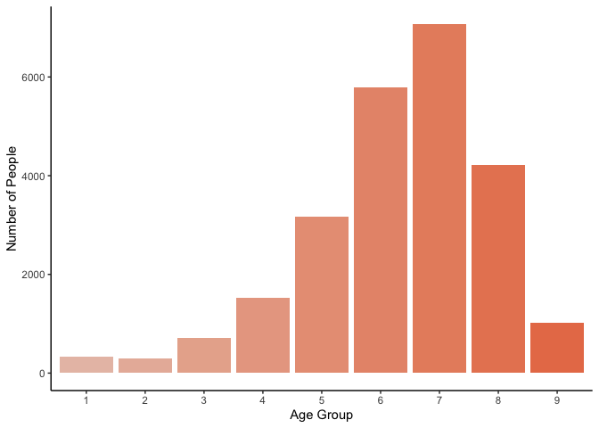

Genetic Mutations from Cancer Therapies
================
Kaitlyn Westra
11 December 2020

-   [Introduction](#introduction)
-   [Question](#question)
-   [Dataset](#dataset)
-   [Exploratory Data Analysis](#exploratory-data-analysis)
-   [Modeling](#modeling)
-   [Findings:](#findings)
-   [Limitations](#limitations)
-   [Future Directions](#future-directions)
-   [Conclusions](#conclusions)
-   [Author](#author)
-   [Appendix](#appendix)

Introduction
------------

*Nature Genetics* is one of the most well-known and well-respected journals in the field of genetics. The work that these articles are based on reflect years of rigorous research, and presents some of the latest and greatest ideas in the field. Due to this, many experts regard getting published in the journal as a great achievement and frequently read these published articles.

Over the past 6 months, I've worked as a research intern at Grand Rapids' Van Andel Institute, in a [lab](https://braslab.vai.org) that studies the genetics of neurodegenerative diseases, like Parkinson's Disease, Alzhiemer's Disease, and dementia with Lewy bodies. Throughout this internship, I have been able to learn about the intersection of genetics, disease, and data science, using R and other genomics tools to analyze genetic mutation data and make discoveries that have an impact on people's lives.

Because of this introduction I've had to the field of genetics annd bioinformatics, I have been curious what *other* labs and groups do with similar data. This lead me to browse through the [cBioPortal for Cancer Genomics](https://www.cbioportal.org), which I had heard about from a series of online [Dataviz + Cancer Microlabs](https://apply.hub.ki/cancerplusviz/) that occured earlier this year. The dataset I had found was used in a recent *Nature Genetics* article, "[Cancer therapy shapes the fitness landscape of clonal hematopoiesis](https://www.nature.com/articles/s41588-020-00710-0)" so I decided this would be perfect for my final project.

Question
--------

#### Background

The story behind this article follows first author Kelly Bolton, a physician scientist (MD-PhD) and first year fellow in medical oncology at Memorial Sloan Kettering, the world’s oldest and largest private cancer center. Bolton was new to studying clonal hematopoiesis (CH), but jumped on the opportunity to research it, especially to understand if specific therapy types resulted in a higher frequency of CH. With her knowledge of epidemiology, she realized that she could use data from both electronic health records and sequential samples from patients, to understand how therapy could be promoting pre-existing CH or inducing new mutations.

CH essentially happens when a hematopoietic stem cell, which can develop into different types of blood cells, starts making cells with the same genetic mutation in individuals without a blood disease. As such, clonal hematopoiesis [includes](https://www.ncbi.nlm.nih.gov/pmc/articles/PMC7065480/) the entire spectrum of premalignant conditions related to somatic mutations in genes associated with myeloid disorders. CH remains benign in most people, but sometimes progresses to malignancy.

Previously, studies have shown that certain types of chemotherapy lead to a higher risk of developing myeloid neoplasms (a class of clonal hematopoietic stem cell disorders), and also that the presence of clonal hematopoiesis increases the risk of developing these therapy-related myleoid neoplasm diseases (tMNs). Thus, the relationship between specific therapies and CH is important to investigate. Understanding this relationship can aid in the understanding of the mechanisms by which therapy-related myeloid diseases occur, and from there, can help develop interventions.

#### Project

With this project, I aim to replicate this lab's findings that mutations in genes are enriched based on specific exposures. Specifically, I will set out to verify that "**mutations in *ASXL1* are enriched in current or former smokers, whereas cancer therapy with radiation, platinum and topoisomerase II inhibitors preferentially selects for mutations in DNA damage response genes (*TP53*, *PPM1D*, *CHEK2*).**"

To do so, I will be recreating their **Figure 1c** using exactly the same data the authors used, and a combination of their published R code and some of my own original code. In this process, I will be thoroughly narrating my steps to give insight into the process and decisions that were made. Because a big part of data science and computer science is looking through others' code, understanding it, and adapting it to fit your needs, doing so with this available example will be an exercise in this skill. Being able to accomplish the objectives I have outlined herein demonstrate the knowledge I've gained this semester in DATA-202, and that I am equipped to practically apply this in new situations.

> *Much of the technical background information, including specific phrases, in this section was found in Bolton's [Nature Research blog post](https://cancercommunity.nature.com/posts/cancer-therapy-shapes-the-fitness-landscape-of-clonal-hematopoiesis).*

Dataset
-------

#### Dataset Background

``` r
M_wide_all = suppressWarnings(data.table::fread('./data/M_wide_all.txt', sep = '\t', header = T)) %>%
  as.data.frame()
```

The dataset used in Figure 1c is originally called `M_wide_all`. It contains brings together data on patients' demographics, exposures, and blood/tumor mutations. Used together, this information allows for correlations to be tested.

The `M_wide_all` dataset was obtained directly from the lab's available [Github repo](https://github.com/papaemmelab/bolton_NG_CH) for this project. Descriptions of how this data was originally acquired, though, are found in the Methods section of the published paper. While a comprehensive overview of the exact details can be found in the paper, a summary is provided here as well. Patients in the MSK-IMPACT cohort had nonhematologic cancers at Memorial Sloan Kettering (MSK) Cancer Center, and data on these patients' ancestry, smoking, date of birth and cancer history was extracted from the MSK cancer registry. Additional blood sample data was added from their Serial Sampling cohort. All participants underwent matched tumor and blood sequencing, which encompassed the exomes of all cancer-associated genes. After sequencing, variant calling for each blood sample was performed by various methods, and variants that were called by two callers were retained. Further, variants were annotated, leaving us with the dataset that appears to be `M_wide_all`.

> *Much of the technical methods information, including specific phrases, in this section was found in the [Nature Article](https://www.nature.com/articles/s41588-020-00710-0) itself.*

I am comfortable saying the data is reliable due to the fact that the authors followed standard scientific protocols, the study was reviewed and accepted by a Institutional Review Board, and the final paper was peer reviewed and published in a high impact journal. Additionally, because this data is from real patients in a well known cancer treatment / research institution, this data is applicable to the questions the authors set out to answer.

#### Dataset Description

`M_wide_all` contains 24146 rows, with 562 columns, making it an extremely large dataset. Because there are 24146 unique `STUDY_ID`s and 24146 rows in this dataset, we know that the `STUDY_ID` acts as a unique identifier for every row. Each row contains data from one patient and their blood/tumor, with columns for:
- their `STUDY_ID`
- the presence/number of mutations in each specific gene (`BRCA1`, `DNAJB1`, `ERBB4`, `FOXO1`, `TET2`, `TP53`, etc.)
- information about these mutations' variant allele fraction (`VAF_all`, `VAF_nonsilent`, `VAF_silent`, `VAF_my`, etc.)
- the number of different types of mutations (`mutnum_all`, `mutnum_nonsilent`, `mutnum_my`, etc.)
- the presence of clonal hematopoiesis mutations (`ch_nonmy`, `CH_nonsilent`, `ch_my_pd` \[PD being "putative cancer-driver mutations"\], etc.)
- demographic information about the patient (`Gender`, `race`, `age`)
- the patient's exposures (`therapy_known`, `therapy_binary`, `smoke`, `ind_cytotoxic_therapy`, `ind_ds_fluorouracil`, etc.).

This very large dataset is appropriate for answering the question answered in Figure 1c. As stated above, there are columns for mutations in many specific genes, which is what we are measuring. Additionally, there are columns for the exposures as well, including Therapy and Smoking. As these are the two primary things shown in Figure 1c, this dataset is applicable to our question of interest.

This dataframe is read in with `fread`, and most columns' data type is as expected. However, there are some instances where I think it would be best if the data were factors (many of the indicator variables or categories) but instead, they are coded as integers or strings. In all of our columns, the data types are broken down below:

| Type      |  \# of Columns|
|:----------|--------------:|
| character |              4|
| integer   |            547|
| numeric   |             11|

Some examples of variables I think should be renamed include:

| Variable              | Current Type | Ideal Type |
|:----------------------|:-------------|:-----------|
| Gender                | character    | factor     |
| ind\_ds\_fluorouracil | integer      | factor     |
| age\_cat              | integer      | factor     |
| smoke                 | integer      | factor     |

As seen in the table above, I would change most datatypes to factor, which could be easily done with the `data.table::fread()` option, `stringsAsFactors = TRUE`. It would make sense to change these to factors due to their use in this analysis -- `Gender` was essentially considered a factor, with the following options: Female, Male, and the indicator variables (like `ind_ds_fluorouracil`) having the following levels: 0, 1. I am unsure of why they chose to leave strings as characters, but because it doesn't really affect the analysis, this isn't an imperative issue.

With the knowledge of which variable names are included in this dataset, it makes sense to explore individual variables further and determine what they mean, what the distribution looks like, and how they're related to other variables. This allows us to to make choices about how to further interpret and analyze this data, as well as give some ideas on which data wrangling steps need to be taken.

Exploratory Data Analysis
-------------------------

#### Univariate EDA

In `M_wide_all`, it appears as if some preprocessing steps have already been taken, such as adding a column for the age categories -- breaking down each person's exact decimal age, into an age bracket. To explore how these age categories are broken down, I created the following table and bar graph:

| Age Group |  Number of People|
|:----------|-----------------:|
| 1         |               337|
| 2         |               297|
| 3         |               708|
| 4         |              1519|
| 5         |              3177|
| 6         |              5788|
| 7         |              7074|
| 8         |              4219|
| 9         |              1027|



From this table and bar graph, we know that there are 9 different age categories, each with the specified number of people. This distribution is left-skewed, and most people appear to be in the higher numbered age groups.

To gain an understanding of what ages are included in each group, I made the following exploratory plot:


As shown above, the age cutoffs for each categroy are: 0.128679, 11.093771, 21.0047913, 31.0006847, 41.0047913, 51.0061607, 61.0020523, 71.0006866, 81.0047913, indicating that they chose 0, 11, 21, 31, 41, 51, 61, 71, 81 as their minimum ages for each age group. These cutoffs appear in grey dashed lines on the series of boxplots, demonstrating that these categories are chosen based on age itself, as opposed to having category containing the same number of people (e.g., 9 quantiles). The violin plot shown demonstrates how many samples are included in the entire dataset, by age, aligned with the violin plots to give a insight into the comparative amount of patients in each group.

Some of the other variables that are primarily used to create Figure 1c are `race`, `mutnum_all`, `smoke`, `Gender`, and `therapy_binary`. However, before creating the figure, they "process dataframes a bit", which I'll walk through next.

#### Data Wrangling

The following code displays the main data wrangling steps used on this data. Below, I explain what this code does, and how it impacts the rest of the analysis.

``` r
M_wide_all = M_wide_all %>%
    mutate(race_b = as.integer(race == "White")) %>%
    mutate(age_scaled = as.vector(scale(age)),
           age_d=age/10) %>%
    mutate(mutnum_all_r = case_when(
      mutnum_all == 0 ~ 0,
      mutnum_all == 1 ~ 1,
      mutnum_all >= 2 ~ 2)) %>%
    mutate(smoke_bin=case_when(
      smoke==0 ~ 0,
      smoke==1 ~ 1,
      smoke==2 ~ 1)) %>%
    mutate(
      Gender = relevel(factor(Gender), ref = 'Male'),
      race = relevel(factor(race), "White"),
      smoke = relevel(factor(smoke), "0"),
      smoke_bin = relevel(factor(smoke_bin), "0"),
      therapy_binary = relevel(factor(therapy_binary), 'untreated')
    )
```

This step of consecutive mutating essentially makes many of the variables of interest into binary factors, which is similar to what I had suggested with the original dataframe. In these above steps, the following variables are created:

-   `race_b`: a binary version of `race`, with a value of 1 for "White", and a 0 for anything else.
-   `age_scaled`: the `age` value, centered (by subtracting the mean `age`) and scaled (by dividing the centered `age` by its standard deviation).
-   `age_d`: simply takes the `age` value and divides it by 10.
-   `mutnum_all_r`: the number of mutations, with a value of 2 for any individual with 2+ mutations.
-   `smoke_bin`: a binary version of `smoke`, with a value of 1 if patient is a current (`smoke` value of 1) or former (`smoke` value of 2) smoker

In the last step of the above code, the variables `Gender`, `race`, `smoke`, `smoke_bin`, and `therapy_binary` are factored and releveled with specific references. - Reference values are important when modelling because any differences are in comparison to the reference category. Because its the basis for which values are compared to, this can change the interpretation of the reuslts.
- After releveling, the resulting base level for the following values are:
<ul>
-   `Gender`: Male
-   `race`: White
-   `smoke`: 0 (never smoker)
-   `smoke_bin`: 0 (never smoker)
-   `therapy_binary`: untreated (no cancer directed therapy during interval other than hormonal therapy)

</ul>
To observe some of these changes, we'll look at what two these variables look like before and after the change:

**Number of Mutations**

Originally, the number of mutations, `mutnum_all`, is broken down into 9 categories. The new variable, `mutnum_all_r`, only has 3 categories. By comparing the breakdowns, we see that any people with more than 2 mutations have been included in the `mutnum_all_r` "2" category. Below is the breakdown of these two variables:

<table>
<caption>
mutnum all
</caption>
<thead>
<tr>
<th style="text-align:left;">
Number of Mutations
</th>
<th style="text-align:right;">
Number of People
</th>
</tr>
</thead>
<tbody>
<tr>
<td style="text-align:left;">
0
</td>
<td style="text-align:right;">
16930
</td>
</tr>
<tr>
<td style="text-align:left;">
1
</td>
<td style="text-align:right;">
4952
</td>
</tr>
<tr>
<td style="text-align:left;">
2
</td>
<td style="text-align:right;">
1544
</td>
</tr>
<tr>
<td style="text-align:left;">
3
</td>
<td style="text-align:right;">
496
</td>
</tr>
<tr>
<td style="text-align:left;">
4
</td>
<td style="text-align:right;">
158
</td>
</tr>
<tr>
<td style="text-align:left;">
5
</td>
<td style="text-align:right;">
46
</td>
</tr>
<tr>
<td style="text-align:left;">
6
</td>
<td style="text-align:right;">
14
</td>
</tr>
<tr>
<td style="text-align:left;">
7
</td>
<td style="text-align:right;">
5
</td>
</tr>
<tr>
<td style="text-align:left;">
8
</td>
<td style="text-align:right;">
1
</td>
</tr>
</tbody>
</table>
<table>
<caption>
mutnum all r
</caption>
<thead>
<tr>
<th style="text-align:left;">
Number of Mutations
</th>
<th style="text-align:right;">
Number of People
</th>
</tr>
</thead>
<tbody>
<tr>
<td style="text-align:left;">
0
</td>
<td style="text-align:right;">
16930
</td>
</tr>
<tr>
<td style="text-align:left;">
1
</td>
<td style="text-align:right;">
4952
</td>
</tr>
<tr>
<td style="text-align:left;">
2
</td>
<td style="text-align:right;">
2264
</td>
</tr>
</tbody>
</table>
**Age Scaling**

In the plot below, the distribution of `age` is shown on top of the distribution of `age_scaled`. The distribution itself is the same, but the age values change (due to the centering and scaling). To see the new values, note the different x-axis value range for `age_scaled`.


In addition to `age_scaled` and `mutnum_all_r`, the variables that are used in Figure 1c include `smoke_bin`, `race_b`, `Gender`, and `therapy_binary`.

**Smoke Binned**

In the processing code above, we saw that `smoke_bin` has a value of 1 if patient is a current (`smoke` value of 1) or former (`smoke` value of 2) smoker, and a 0 if they have never been a smoker. The number of people in each of these categories is shown below, demonstrating that there is a similar amount of people who are current/former smokes and have never smoked.


**Race Binary**

`race_b` was also created in the processing code shown above, as a binary version of `race` with a value of 1 for "White", and a 0 for anything else. The amount of people that fall into each of these categories is shown below, with the majority of patients in this study being white.


**Gender**

`Gender` is a factor with one of two values: Male or Female. Here is the breakdown for participants in this study, displaying a comparable number of each gender, with slightly more females.


**Therapy Binary**

Lastly, `therapy_binary` indicates if the patient had any cancer directed therapy other than hormonal therapy. Based on the distrubtion below, it is evident that for most of the original patients, it was unknown whether or not they had therapy during the interval. Of the patients where their therapy status was known, there were more treated patients than untreated.


From this point in the authors' code, the dataset was subsetted to create a new dataset:

``` r
#Define wide data frame with treatment known
M_wide <- M_wide_all %>% filter(therapy_known==1)
```

This newly created dataset, `M_wide`, contains only the rows where the therapy information is known. This is an appropriate way to identify and deal with missing data, which is necessary due to the large amount of patients with unknown therapy history, as shown in the plot above. Subsetting this dataset into `M_wide` ensures that the data we're using contains all the information we need, and allows for the comparisons to be made.

#### Bivariate EDA

To do some exploratory bivariate data analysis, I made a series of quick plots to see what relationships might be present between our variables of interest.

I am first looking at the relationship between the presence of mutations in the gene *TP53* (`TP53`) and whether the patient recieved therapy (`therapy_binary`) during this period. Because these are each binary variables, it really only makes sense to calculate the odds ratio, but to show this same idea in a figure, the number of people that belong to each of these categories is shown in a 2-by-2 table. From this, we see that there seems to be a higher percentage of people with *TP53* mutations in the treated group than the untreated group:


Similarly, we can make the same plot for `smoke_bin` and the mutations in the gene *ASXL1* (`ASXL1`). From this, we see that there seems to be a higher percentage of current/former smokers (`smoke_bin` == 1) with mutations in ASXL1 compared to non-smokers.


Just out of curiousity, we'll check the same thing -- if the presence of mutations correlates with smoking status -- in a *different* gene: *TET2*. Based on Figure 1c, I'd expect this not to show a significant difference between the groups. As expected, the figure below shows that there doesn't appear to be a significnatly higher amount of current/former smokers with new mutations in this gene compared to non-smokers.


All of these bivariate plots give us some insight into what we expect to see with the model we create, and the odds ratio we'll be calculating. These plots don't adjust or control for any variables though, so this is something to keep in mind as we move forward.

Modeling
--------

From the figure legend, we see that the question in Figure 1c is whether *specific molecular subtypes of CH-PD correlate with age, previous therapy exposure and smoking history*. The authors answer this question by creating *multivariable logistic regression models adjusted for therapy, smoking, ancestry, age, sex and time from diagnosis to blood draw.* In Figure 1c, they display the odds ratio with its 95% confidence interval for CH-PD mutations in the ten most commonly mutated genes. They show three consecutive forest plots displaying different groups compared; for the top, increasing age (n = 10,138); middle, patients previously exposed to cancer therapy (n = 5,978) compared with those with no exposure (n = 4,160); bottom, current/former smokers (n = 4,989) compared with nonsmokers (n = 5,145). Significance levels are determined by Q values (FDR-corrected P values): \* Q &lt; 0.05, \*\* Q &lt; 0.01, \*\*\* Q &lt; 0.001.

Clearly state what is the target variable you are trying to predict, which variables (features) you are using to predict it, and why you chose those features.

-   **Modeling setup/ task description**: Modeling task is both clearly described and well motivated (e.g., alternative decisions are identified and considered)
    -   more than: *Clear description of the model setup. e.g., for a predictive model, what are the features and targets, why those were chosen, what validation method was employed and why, etc.*

Fit a basic predictive model using one of the techniques we discussed in class (regression: Nearest Neighbors or Linear Regression, classification: Nearest Neighbors or Logistic Regression; other choices such as Decision Trees are also fine)

Report the results of your basic predictive model on held-out data or via cross-validation.

-   **Modeling baselie results**: A baseline was thoughtfully chosen and evaluated.
    -   more than: *Results of a correctly applied baseline model are reported correctly*

Make one or more changes to the predictive model to improve the accuracy. Discuss what changes you made, why you made them, and what the results were.

-   **Modeling refinements**: Particular thought or insight was given to the choice of changes to make and/or analysis of their implications.
    -   more than: *Reports what changes were made, why they were made, and what the results were.*

**Alternative**: instead of a supervised prediction task, you can define an unsupervised learning task and use clustering. In this case, clearly state what you want to understand through the clustering, and report your observations.

\[FIXTHIS: pick up on rubric here... **Discussion of findings**\]

Direct Code from Reviewer\_Code.Rmd (from here, I just need 1c):

``` r
## Main figures
# Figure 1 - mutational characteristics
hide_this_too <- function(){
  # panel_theme = theme_bw() + theme(
  #     panel.border = element_blank(),
  #     legend.position = "none",
  #     panel.grid.minor = element_blank(),
  #     plot.subtitle = element_text(hjust = 0.5, size = 8),
  #     plot.title = element_text(face = 'bold', size = 12, hjust = 0, vjust = -11),
  #     panel.grid.major = element_blank(),
  #     strip.background = element_blank(),
  #     strip.text = element_text(size = 6),
  #     axis.text.y = element_text(size = 6),
  #     axis.text.x = element_text(size = 6),
  #     axis.title = element_text(size = 8),
  #     axis.line = element_line(),
  #     plot.margin = unit(c(0,0,0,0), 'pt')
  # ) 
  # 
  # age_groups = c("0-10", "11-20", "21-30", "31-40", "41-50", "51-60", "61-70", "71-80", "81-90", "91-100")
  # 
  # get_ch_grouped = function(M_wide, CI = T) {
  # 
  #     CH_by_age_grouped = M_wide %>% select(STUDY_ID, age_cat, CH) %>%
  #         mutate(CH = ifelse(is.na(CH), 0, CH)) %>%
  #         group_by(age_cat) %>%
  #         summarise(CH = sum(CH), total = n()) %>% 
  #         filter(!is.na(age_cat)) %>%
  #         mutate(freq = CH / total)
  #     
  #     if (CI) {
  #         CH_by_age_grouped = CH_by_age_grouped %>%
  #         cbind(
  #             apply(CH_by_age_grouped, 1, function(row) {
  #                 CI = prop.test(row['CH'], row['total'], conf.level=0.95)$conf.int[1:2]
  #                 return(c(lower = CI[1], upper = CI[2]))
  #             }) %>% t
  #         )
  #     }
  #     
  #     return(CH_by_age_grouped)
  # }
  # 
  # font_size = 8
  # age_curve_theme = 
  #   theme(
  #       legend.position = 'top',
  #       legend.key.size = unit(5, 'mm'),
  #       legend.title = element_blank(),
  #       legend.direction = 'horizontal',
  #       plot.title = element_text(hjust = -0.08),
  #       axis.text.x = element_text(angle = 45, vjust = 0.5, size = font_size),
  #       axis.text.y = element_text(size = font_size),
  #       axis.title = element_text(size = font_size),
  #       legend.text = element_text(size = font_size)
  #   )
}

hide_for_now <- function() {
  # this is a fake function for me to be able to hide this section of the chunk while still keeping it in (using RStudio's nice arrow things). Eventually, I will delete this, but I wanted to keep it in for a bit. 
  # ## Histogram by gene frequency
  # gene_list = M %>% count(Gene) %>% arrange(-n) %>% .$Gene %>% unique %>% .[1:10]
  # 
  # n_treated = M_wide %>% count(therapy_binary) %>% filter(therapy_binary == 'treated') %>% pull(n)
  # n_untreated = M_wide %>% count(therapy_binary) %>% filter(therapy_binary == 'untreated') %>% pull(n)
  # 
  # # tally
  # D = M %>% 
  #     filter(CH_nonsilent == 1) %>%
  #     reshape2::dcast(
  #         formula = Gene + therapy_binary ~ .,
  #         value.var = 'STUDY_ID',
  #         fun.aggregate = function(STUDY_IDs) {length(unique(STUDY_IDs))}
  #     ) %>%
  #     dplyr::rename("n_patient" = ".") %>%
  #     mutate(
  #         prop_patient = case_when(
  #             therapy_binary == 'treated' ~ n_patient/n_treated,
  #             therapy_binary == 'untreated' ~ n_patient/n_untreated
  #         )
  #     ) %>%
  #     filter(Gene %in% gene_list) %>%
  #     mutate(
  #         Gene = factor(Gene, gene_list),
  #         therapy_binary = factor(therapy_binary, c('untreated', 'treated'))
  #     ) %>%
  #     arrange(Gene)
  # 
  # # need to test for ch_nonsilent, the gene columns in M_wide are ch_pancan_pd
  # asterisks = lapply(gene_list, 
  #     function(gene) {
  #         model = glm(
  #             formula = paste0(gene, ' ~ age_scaled + smoke_bin + race_b + Gender + therapy_binary'),
  #             data = M_wide,
  #             family = "binomial")
  #         treatment_pval = model %>% summary %$% coefficients %>% .['therapy_binarytreated', 'Pr(>|z|)']
  #         treatment_qval = p.adjust(treatment_pval, method = 'fdr', n = length(gene_list))
  #         return(signif.num(treatment_qval, ns = F))
  #     }
  # )
  # 
  # p_hist = ggplot(
  #       D,
  #       aes(x = Gene, y = prop_patient, fill = therapy_binary)
  #   ) +
  #   geom_bar(stat = 'identity', position = "dodge", color = 'black', size = 0.25) +
  #   panel_theme +
  #   theme(
  #       panel.grid.major = element_blank(), 
  #       panel.border = element_blank(),
  #       axis.line = element_line(colour = "black"),
  #       legend.title = element_blank(),
  #       legend.key.size = unit(5, 'mm'),
  #       legend.position = 'top',
  #       legend.direction = 'horizontal',
  #       axis.title = element_text(size = font_size),
  #       axis.text.x = element_text(angle = 45, hjust = 1, size = font_size),
  #       legend.text = element_text(size = font_size)
  #   ) +
  #   annotate('text', x = gene_list, y = 0.11, label = asterisks, size = 4) +
  #   ylab("Proportion with mutated Gene") +
  #   xlab('') +
  #   scale_fill_manual(values = therapy_colors) +
  #   scale_color_manual(values = therapy_colors)
}

## forest plot
DTA = c('DNMT3A', 'TET2', 'ASXL1')
DDR = c('PPM1D', 'TP53', 'CHEK2')
SPL = c('SF3B1', 'SRSF2')
OTH = c('JAK2', 'ATM')

gene_list = c(DDR, DTA, SPL, OTH)

#ALL adjusted for treatment
logit_gene_var = list()

for (gene in gene_list) {
    logit = glm(
        formula = get(gene) ~ age_scaled + smoke_bin + race_b + Gender + therapy_binary,
        data = M_wide,
        family = "binomial")
    logit_data = logit %>% sjPlot::get_model_data(type="est") %>% cbind(Gene = gene)
    logit_gene_var = rbind(logit_gene_var, logit_data)
}

# for each gene
D = logit_gene_var %>%
    filter(!term %in% c("GenderFemale", "race_b")) %>%
    mutate(
        term = c(
            'therapy_binarytreated' = 'Therapy',
            'smoke_bin1' = 'Smoking',
            'age_scaled' = 'Age'
        )[as.character(term)]
    ) %>%
    mutate(term = factor(term, c("Age", "Therapy", "Smoking"))) %>%
    mutate(p_fdr = p.adjust(p.value, method = "fdr")) %>%
    mutate(termGene = paste0(term, Gene)) %>%
    arrange(estimate, Gene) %>%
    mutate(termGene = factor(termGene, levels = termGene)) %>%
    mutate(gene_cat = case_when(
        Gene %in% DTA ~ 'DTA', 
        Gene %in% DDR ~ 'DDR', 
        Gene %in% SPL ~ 'Splicing', 
        T ~ 'Other'
      )
    ) %>% 
    mutate(gene_cat = factor(gene_cat, c('DDR', 'DTA', 'Splicing', 'Other'))) %>%
    mutate(
        q.value = p.adjust(p.value, n = nrow(.), method = 'fdr'), #"p.adjust" adjusts p-values for multiple comparisons (using the Benjamini & Hochberg (1995) correction method)
        q.label = paste0(signif(estimate, 2), signif.num(q.value)),
        q.star = signif.num(q.value)
    )

p_forest = plot_forest(
      D,
      x = "termGene",
      label = 'q.star',
      eb_w = 0,
      eb_s = 0.3,
      ps = 1.5,
      or_s = 2,
      nudge = -0.3,
      col = 'gene_cat'
  ) + 
  facet_wrap(~term, scale = 'free_y', ncol = 1) +
  scale_x_discrete(
      breaks = D$termGene,
      labels = D$Gene,
      expand = c(0.1,0)
  ) +
  xlab('') + ylab('Odds Ratio of CH-PD') +
  scale_color_nejm() +
  panel_theme +
  theme(
    axis.text = element_text(size = font_size),
    axis.title = element_text(size = font_size),
    strip.text = element_text(size = font_size),
    legend.position = 'top',
    legend.title = element_blank(),
    legend.text = element_text(size = font_size/1.2),
    legend.key.size = unit(3, "mm")
  ) 

combo = ((p_hist + labs(title = 'A')) / (p_stack + labs(title = 'B'))) | (p_forest+ labs(title = 'C'))

do_plot(combo, "fig1c.png", 10, 6, save_pdf = F) #no pdf
```

Findings:
---------

Summarize the analyses you performed and what the results told you. What do your findings say about the real-world and prediction (or clustering) questions you posed?

Limitations
-----------

What are some limitations of your analyses and potential biases of the data you used?

and Ethical Considerations

Future Directions
-----------------

What new questions came up following your exploration of this data? Describe at least one question that could not be answered using your data alone, and specify what additional data you would collect to address it.

Conclusions
-----------

> this is my own added section. see if I want to include this or not. if not, put this paragraph somewhere else

In addressing this question, I gained not only an understanding of how data science is used in my chosen career field, but also an appreciation for the hard work done by women in STEM -- as, to my surprise, first author Kelly Bolton MD PhD, as well as lab PI, Elli Papaemmanuil, PhD, are both women.

Author
------

######  Kaitlyn Westra is an undergraduate student at Calvin University, studying Biochemistry (ACS Certified), Data Analytics, and Public Health. Her interests include bioinformatics, genomics, and computational biology, and she hopes to attend graduate school to continue learning about and contributing towards these fields.

Appendix
--------

``` r
knitr::opts_chunk$set(echo = TRUE)
library(tidyverse)
M_wide_all = suppressWarnings(data.table::fread('./data/M_wide_all.txt', sep = '\t', header = T)) %>%
  as.data.frame()
knitr::kable(table(sapply(M_wide_all, class)), col.names = c("Type", "# of Columns"))
data.frame(Variable = c("Gender",
                        "ind_ds_fluorouracil",
                        "age_cat",
                        "smoke"),
           `CurrentType` = c(typeof(M_wide_all$Gender),
                              typeof(M_wide_all$ind_ds_fluorouracil),
                              typeof(M_wide_all$age_cat),
                              typeof(M_wide_all$smoke)),
           `IdealType` = c(rep("factor",4))) %>%
  knitr::kable(col.names = c("Variable", "Current Type", "Ideal Type"))
#how many age groups are there?
table(M_wide_all$age_cat) %>%
  as.data.frame() %>%
  rename(`Age Group` = Var1,
         `Number of People` = Freq) %>%
  knitr::kable()

ggplot(data = as.data.frame(table(M_wide_all$age_cat)), aes(x = Var1, y = Freq)) +
  geom_col(fill = c("#e8c1b3", "#e8b8a7", "#e8b09b", "#e8a790", "#e89f84", "#e89679", "#e88e6d", "#e88561", "#e87d56")) + ##e79e84 base color
  theme_classic() +
  labs(x = "Age Group", y = "Number of People")
#give min of each boxplot / age group:
age_cutoffs <- c()
for (num in 1:9) {
  age_cutoffs <- c(age_cutoffs, M_wide_all[M_wide_all$age_cat == num,] %>%
    select(age) %>%
    min())
}
split_age_box <- ggplot(M_wide_all, aes(y = age, x = as.factor(age_cat), fill = as.factor(age_cat))) +
  geom_boxplot() +
  scale_fill_brewer(palette = "BuGn") +
  theme_classic() +
  theme(legend.position = "none") +
  labs(x = "Age Group", y = "Age", fill = "Age Group") +
  scale_y_continuous(breaks = c(0, 11, 21, 31, 41, 51, 61, 71, 81),
                   labels = c(0, 11, 21, 31, 41, 51, 61, 71, 81)) +
  geom_hline(aes(yintercept = age_cutoffs[2]), linetype = "dashed", color = "grey") +
  geom_hline(aes(yintercept = age_cutoffs[3]), linetype = "dashed", color = "grey") +
  geom_hline(aes(yintercept = age_cutoffs[4]), linetype = "dashed", color = "grey") +
  geom_hline(aes(yintercept = age_cutoffs[5]), linetype = "dashed", color = "grey") +
  geom_hline(aes(yintercept = age_cutoffs[6]), linetype = "dashed", color = "grey") +
  geom_hline(aes(yintercept = age_cutoffs[7]), linetype = "dashed", color = "grey") +
  geom_hline(aes(yintercept = age_cutoffs[8]), linetype = "dashed", color = "grey") +
  geom_hline(aes(yintercept = age_cutoffs[9]), linetype = "dashed", color = "grey")

together_age_violin <- ggplot(M_wide_all, aes(y = age, x = 0)) +
  geom_violin(fill = "white") +
  theme_void() +
  labs(x = "Full Dataset", y = "Age") +
  theme(axis.ticks.x = element_blank(),
        axis.text.x = element_blank())

cowplot::plot_grid(split_age_box, together_age_violin, ncol = 2, rel_widths = c(.75, .25), align = "h")
M_wide_all = M_wide_all %>%
    mutate(race_b = as.integer(race == "White")) %>%
    mutate(age_scaled = as.vector(scale(age)),
           age_d=age/10) %>%
    mutate(mutnum_all_r = case_when(
      mutnum_all == 0 ~ 0,
      mutnum_all == 1 ~ 1,
      mutnum_all >= 2 ~ 2)) %>%
    mutate(smoke_bin=case_when(
      smoke==0 ~ 0,
      smoke==1 ~ 1,
      smoke==2 ~ 1)) %>%
    mutate(
      Gender = relevel(factor(Gender), ref = 'Male'),
      race = relevel(factor(race), "White"),
      smoke = relevel(factor(smoke), "0"),
      smoke_bin = relevel(factor(smoke_bin), "0"),
      therapy_binary = relevel(factor(therapy_binary), 'untreated')
    )
table(M_wide_all$mutnum_all) %>%
  knitr::kable(col.names = c("Number of Mutations","Number of People"),
               caption = "mutnum all",
               format = "html")
table(M_wide_all$mutnum_all_r) %>%
  knitr::kable(col.names = c("Number of Mutations","Number of People"),
               caption = "mutnum all r",
               format = "html")
original_age_density <- ggplot(data = M_wide_all, aes(x = age)) +
  geom_density(fill = "#5691c1") +
  theme_classic() +
  labs(x = "Age", y = "Number of People") +
  theme(axis.ticks.y = element_blank(),
        axis.text.y = element_blank())

scaled_age_denstiy <- ggplot(data = M_wide_all, aes(x = age_scaled)) +
  geom_density(fill = "#5691c1") +
  theme_classic() +
  labs(x = "Scaled Age", y = "Number of People") +
  theme(axis.ticks.y = element_blank(),
        axis.text.y = element_blank()) +
  scale_x_continuous(position = "top") +
  scale_y_reverse()
cowplot::plot_grid(original_age_density, scaled_age_denstiy, nrow = 2, align = "v")
ggplot(data = M_wide_all, aes(x = smoke_bin)) +
  geom_bar(fill = c("#8e3b18","#be5422", "#ef924e")) +
  theme_classic() +
  labs(x = "Smoking Status", y = "Number of People")
ggplot(data = M_wide_all, aes(x = as.factor(race_b))) +
  geom_bar(fill = c("#405484","#8691b1")) +
  theme_classic() +
  labs(x = "Race", y = "Number of People")
ggplot(data = M_wide_all, aes(x = as.factor(Gender))) +
  geom_bar(fill = c("#469d89","#9fcfc3")) +
  theme_classic() +
  labs(x = "Gender", y = "Number of People")
ggplot(data = M_wide_all, aes(x = as.factor(therapy_binary))) +
  geom_bar(fill = c("#e7c9c1", "#cc9685", "#bfbfbf")) +
  theme_classic() +
  labs(x = "Therapy", y = "Number of People")
#Define wide data frame with treatment known
M_wide <- M_wide_all %>% filter(therapy_known==1)
M_wide %>%
  group_by(therapy_binary, TP53) %>%
  summarize(number = n(), .groups = "drop") %>%
  ungroup() %>%
  ggplot(data = ., aes(x = as.factor(TP53), y = as.factor(therapy_binary), label = number)) +
    geom_label(label.size = .1, label.padding = unit(1, "lines")) +
    labs(x = "TP53 Mutation", y = "Therapy") +
    theme_light()
M_wide %>%
  filter(!is.na(smoke_bin)) %>%
  group_by(smoke_bin, ASXL1) %>%
  summarize(number = n(), .groups = "drop") %>%
  ungroup() %>%
  ggplot(data = ., aes(x = as.factor(ASXL1), y = as.factor(smoke_bin), label = number)) +
    geom_label(label.size = .1, label.padding = unit(1, "lines")) +
    labs(x = "ASXL1 Mutation", y = "Smoker") +
    theme_light()
M_wide %>%
  filter(!is.na(smoke_bin)) %>%
  group_by(smoke_bin, TET2) %>%
  summarize(number = n(), .groups = "drop") %>%
  ungroup() %>%
  ggplot(data = ., aes(x = as.factor(TET2), y = as.factor(smoke_bin), label = number)) +
    geom_label(label.size = .1, label.padding = unit(1, "lines")) +
    labs(x = "TET2 Mutation", y = "Smoker") +
    theme_light()
## Main figures
# Figure 1 - mutational characteristics
hide_this_too <- function(){
  # panel_theme = theme_bw() + theme(
  #     panel.border = element_blank(),
  #     legend.position = "none",
  #     panel.grid.minor = element_blank(),
  #     plot.subtitle = element_text(hjust = 0.5, size = 8),
  #     plot.title = element_text(face = 'bold', size = 12, hjust = 0, vjust = -11),
  #     panel.grid.major = element_blank(),
  #     strip.background = element_blank(),
  #     strip.text = element_text(size = 6),
  #     axis.text.y = element_text(size = 6),
  #     axis.text.x = element_text(size = 6),
  #     axis.title = element_text(size = 8),
  #     axis.line = element_line(),
  #     plot.margin = unit(c(0,0,0,0), 'pt')
  # ) 
  # 
  # age_groups = c("0-10", "11-20", "21-30", "31-40", "41-50", "51-60", "61-70", "71-80", "81-90", "91-100")
  # 
  # get_ch_grouped = function(M_wide, CI = T) {
  # 
  #     CH_by_age_grouped = M_wide %>% select(STUDY_ID, age_cat, CH) %>%
  #         mutate(CH = ifelse(is.na(CH), 0, CH)) %>%
  #         group_by(age_cat) %>%
  #         summarise(CH = sum(CH), total = n()) %>% 
  #         filter(!is.na(age_cat)) %>%
  #         mutate(freq = CH / total)
  #     
  #     if (CI) {
  #         CH_by_age_grouped = CH_by_age_grouped %>%
  #         cbind(
  #             apply(CH_by_age_grouped, 1, function(row) {
  #                 CI = prop.test(row['CH'], row['total'], conf.level=0.95)$conf.int[1:2]
  #                 return(c(lower = CI[1], upper = CI[2]))
  #             }) %>% t
  #         )
  #     }
  #     
  #     return(CH_by_age_grouped)
  # }
  # 
  # font_size = 8
  # age_curve_theme = 
  #   theme(
  #       legend.position = 'top',
  #       legend.key.size = unit(5, 'mm'),
  #       legend.title = element_blank(),
  #       legend.direction = 'horizontal',
  #       plot.title = element_text(hjust = -0.08),
  #       axis.text.x = element_text(angle = 45, vjust = 0.5, size = font_size),
  #       axis.text.y = element_text(size = font_size),
  #       axis.title = element_text(size = font_size),
  #       legend.text = element_text(size = font_size)
  #   )
}

hide_for_now <- function() {
  # this is a fake function for me to be able to hide this section of the chunk while still keeping it in (using RStudio's nice arrow things). Eventually, I will delete this, but I wanted to keep it in for a bit. 
  # ## Histogram by gene frequency
  # gene_list = M %>% count(Gene) %>% arrange(-n) %>% .$Gene %>% unique %>% .[1:10]
  # 
  # n_treated = M_wide %>% count(therapy_binary) %>% filter(therapy_binary == 'treated') %>% pull(n)
  # n_untreated = M_wide %>% count(therapy_binary) %>% filter(therapy_binary == 'untreated') %>% pull(n)
  # 
  # # tally
  # D = M %>% 
  #     filter(CH_nonsilent == 1) %>%
  #     reshape2::dcast(
  #         formula = Gene + therapy_binary ~ .,
  #         value.var = 'STUDY_ID',
  #         fun.aggregate = function(STUDY_IDs) {length(unique(STUDY_IDs))}
  #     ) %>%
  #     dplyr::rename("n_patient" = ".") %>%
  #     mutate(
  #         prop_patient = case_when(
  #             therapy_binary == 'treated' ~ n_patient/n_treated,
  #             therapy_binary == 'untreated' ~ n_patient/n_untreated
  #         )
  #     ) %>%
  #     filter(Gene %in% gene_list) %>%
  #     mutate(
  #         Gene = factor(Gene, gene_list),
  #         therapy_binary = factor(therapy_binary, c('untreated', 'treated'))
  #     ) %>%
  #     arrange(Gene)
  # 
  # # need to test for ch_nonsilent, the gene columns in M_wide are ch_pancan_pd
  # asterisks = lapply(gene_list, 
  #     function(gene) {
  #         model = glm(
  #             formula = paste0(gene, ' ~ age_scaled + smoke_bin + race_b + Gender + therapy_binary'),
  #             data = M_wide,
  #             family = "binomial")
  #         treatment_pval = model %>% summary %$% coefficients %>% .['therapy_binarytreated', 'Pr(>|z|)']
  #         treatment_qval = p.adjust(treatment_pval, method = 'fdr', n = length(gene_list))
  #         return(signif.num(treatment_qval, ns = F))
  #     }
  # )
  # 
  # p_hist = ggplot(
  #       D,
  #       aes(x = Gene, y = prop_patient, fill = therapy_binary)
  #   ) +
  #   geom_bar(stat = 'identity', position = "dodge", color = 'black', size = 0.25) +
  #   panel_theme +
  #   theme(
  #       panel.grid.major = element_blank(), 
  #       panel.border = element_blank(),
  #       axis.line = element_line(colour = "black"),
  #       legend.title = element_blank(),
  #       legend.key.size = unit(5, 'mm'),
  #       legend.position = 'top',
  #       legend.direction = 'horizontal',
  #       axis.title = element_text(size = font_size),
  #       axis.text.x = element_text(angle = 45, hjust = 1, size = font_size),
  #       legend.text = element_text(size = font_size)
  #   ) +
  #   annotate('text', x = gene_list, y = 0.11, label = asterisks, size = 4) +
  #   ylab("Proportion with mutated Gene") +
  #   xlab('') +
  #   scale_fill_manual(values = therapy_colors) +
  #   scale_color_manual(values = therapy_colors)
}

## forest plot
DTA = c('DNMT3A', 'TET2', 'ASXL1')
DDR = c('PPM1D', 'TP53', 'CHEK2')
SPL = c('SF3B1', 'SRSF2')
OTH = c('JAK2', 'ATM')

gene_list = c(DDR, DTA, SPL, OTH)

#ALL adjusted for treatment
logit_gene_var = list()

for (gene in gene_list) {
    logit = glm(
        formula = get(gene) ~ age_scaled + smoke_bin + race_b + Gender + therapy_binary,
        data = M_wide,
        family = "binomial")
    logit_data = logit %>% sjPlot::get_model_data(type="est") %>% cbind(Gene = gene)
    logit_gene_var = rbind(logit_gene_var, logit_data)
}

# for each gene
D = logit_gene_var %>%
    filter(!term %in% c("GenderFemale", "race_b")) %>%
    mutate(
        term = c(
            'therapy_binarytreated' = 'Therapy',
            'smoke_bin1' = 'Smoking',
            'age_scaled' = 'Age'
        )[as.character(term)]
    ) %>%
    mutate(term = factor(term, c("Age", "Therapy", "Smoking"))) %>%
    mutate(p_fdr = p.adjust(p.value, method = "fdr")) %>%
    mutate(termGene = paste0(term, Gene)) %>%
    arrange(estimate, Gene) %>%
    mutate(termGene = factor(termGene, levels = termGene)) %>%
    mutate(gene_cat = case_when(
        Gene %in% DTA ~ 'DTA', 
        Gene %in% DDR ~ 'DDR', 
        Gene %in% SPL ~ 'Splicing', 
        T ~ 'Other'
      )
    ) %>% 
    mutate(gene_cat = factor(gene_cat, c('DDR', 'DTA', 'Splicing', 'Other'))) %>%
    mutate(
        q.value = p.adjust(p.value, n = nrow(.), method = 'fdr'), #"p.adjust" adjusts p-values for multiple comparisons (using the Benjamini & Hochberg (1995) correction method)
        q.label = paste0(signif(estimate, 2), signif.num(q.value)),
        q.star = signif.num(q.value)
    )

p_forest = plot_forest(
      D,
      x = "termGene",
      label = 'q.star',
      eb_w = 0,
      eb_s = 0.3,
      ps = 1.5,
      or_s = 2,
      nudge = -0.3,
      col = 'gene_cat'
  ) + 
  facet_wrap(~term, scale = 'free_y', ncol = 1) +
  scale_x_discrete(
      breaks = D$termGene,
      labels = D$Gene,
      expand = c(0.1,0)
  ) +
  xlab('') + ylab('Odds Ratio of CH-PD') +
  scale_color_nejm() +
  panel_theme +
  theme(
    axis.text = element_text(size = font_size),
    axis.title = element_text(size = font_size),
    strip.text = element_text(size = font_size),
    legend.position = 'top',
    legend.title = element_blank(),
    legend.text = element_text(size = font_size/1.2),
    legend.key.size = unit(3, "mm")
  ) 

combo = ((p_hist + labs(title = 'A')) / (p_stack + labs(title = 'B'))) | (p_forest+ labs(title = 'C'))

do_plot(combo, "fig1c.png", 10, 6, save_pdf = F) #no pdf
```
